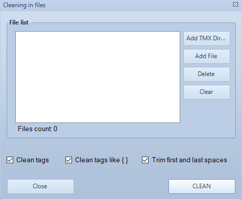

# Goldpan — бесплатный редактор и конвертер файлов TMX и TBX

С большим удовольствием мы предоставляем этот полезный инструмент всем переводчикам бесплатно.
Профессиональная версия программы отличается тем, что ряд ключевых функций, доступных в бесплатной версии, оптимизированы для нужд крупных компаний и пакетной обработки данных. Этот пакет распространяется по платной подписке. Однако все основные функции Goldpan совершенно бесплатны и таковыми останутся.

Текущая версия Goldpan: 3.6.1.

## Для чего нужна программа Goldpan?

Программа Goldpan была создана для обработки двуязычных файлов, используемых в процессе перевода любого контента в CAT-системах. Целью этой обработки является сохранение и повторное использование лингвистической информации, которая накапливается у переводчиков по мере их работы. Программа Goldpan позволяет:

- преобразовывать различные двуязычные файлы в универсальный формат TMX для сохранения в виде памяти переводов;

- обрабатывать имеющиеся файлы памяти переводов (ТМ), редактировать их, извлекать терминологию;

- удалять ненужную служебную разметку (внутренние теги) из файлов перед их загрузкой в CAT-систему или на сервер памяти переводов;

- готовить массивы памяти переводов для обучения систем машинного перевода.

## Что можно делать с накопленной библиотекой памяти переводов?

Файлы памяти переводов можно просто подготовить и очистить для дальнейшего хранения на локальном компьютере или на файловом сервере организации. Но такой способ организации лингвистических активов давно устарел — он не позволяет эффективно повторно использовать накопленные переводы.

Лучше всего хранить очищенные массивы памяти переводов на облачном сервере, где эти разрозненные файлы превращаются в единый источник переводов для отдельного пользователя или для целой организации.

Компания Logrus Global предлагает соответствующее решение: **Memose**. Облачная платформа **Memose** позволяет:

- упорядочить и централизовать хранение массивов памяти переводов и управление ими;

- выполнять поиск фраз и предложений (поиск по конкордансу) сразу по всем имеющимся массивам памяти переводов;

- собирать проектные памяти переводов для подключения к любым CAT-системам;

- и даже переводить и редактировать непосредственно файлы формата XLIFF! 

Чтобы больше узнать о платформе Memose, напишите нам по адресу: marcom @ logrusglobal.com.

## Поддерживаемые операционные системы

Поддерживается только Windows x64. Не поддерживаются: Windows x32, OS X, Linux.

Для организаций по запросу возможна доработка имеющихся функций программы и разработка новых за соответствующую плату. Запросы частных лиц принимаются в разработку по нашему усмотрению и за наш счет. Пожертвования на улучшение программы всегда приветствуются.

## Установка программы Goldpan

Для установки программы Goldpan зайдите на сайт Logrus Global Localization Cloud (https://cloud.logrusglobal.com/) и выберите раздел Goldpan. Нажмите кнопку **Try it**. Вы будете перенаправлены в личный кабинет пользователя Logrus Global Localization Cloud, где можно скачать текущую версию программы.

Нажмите ссылку **Free Download** на карточке программы Goldpan.

Будет запущена загрузка текущего дистрибутива в виде файла формата MSI. По завершении загрузки запустите этот файл и завершите установку.

## Версия PRO

Если ваша учетная запись на платформе Logrus Global Localization Cloud авторизована для использования версии Goldpan **PRO**, нажмите кнопку **PRO Version** на вкладке Home или на вкладке Help меню программы и введите имя и пароль вашей учетной записи. После этого будут активированы функции **PRO Version**.

В настоящее время следующие функции доступны только в версии **PRO**:

- пакетная очистка тегов в файлах (кнопка **Clean tags in files** на вкладке Batch Tools — см. ниже раздел **Очистка тегов**).

## Создание, открытие, редактирование файлов TMX и TBX

Программа Goldpan является простым, но мощным инструментом для создания и редактирования файлов многоязычной памяти переводов (TMX) и файлов глоссариев (TBX) с не более чем девятью языками одновременно.

В простом интерфейсе пользователя реализовано множество функций. Не все из них очевидны — такие функции описаны в этой справке.

### Поддерживаемые форматы файлов

Программа Goldpan поддерживает разные форматы файлов для импорта данных в программу и для экспорта данных из нее. Некоторые из этих форматов файлов только читаются (импортируются), но не экспортируются.

### Импорт

В программу Goldpan можно импортировать файлы переводческих ресурсов следующих форматов: **SDLTM**, **SDLXLIFF**, **XLIFF**, **TMX**, **TBX**.

Чтобы импортировать в программу переводческие ресурсы из какого-нибудь файла, на вкладке Import/Export нажмите кнопку Import File. В диалоговом окне импорта выберите нужный формат в раскрывающемся списке, затем найдите и выделите требуемый файл. Импорт возможен только из одного файла за раз. Для импорта нескольких файлов повторите процедуру для каждого файла отдельно.

### Экспорт

Чтобы экспортировать данные из программы, нужно выбрать соответствующие строки, а затем экспортировать их в виде файла формата **TMX**, **XLIFF**, **TBX** или **XLSX**.

Экспорт из программы Goldpan выполняется только из специального буфера обмена. Для переноса данных в этот буфер служат кнопки **Move to Memory** (перемещение) и **Copy to Memory** (копирование) на вкладке **Import/Export**. Операция **Move to Memory** удаляет выделенные сегменты из окна редактирования при их переносе в буфер. Команда **Copy to Memory** сохраняет исходные сегменты на их месте. Выделить нужные сегменты можно стандартным образом —  щелчком при нажатой клавише SHIFT или CTRL, либо путем перетаскивания. Сегменты перемещаются или копируются только целиком. Если сегмент выделен частично, он все равно будет перемещен или скопирован целиком. Для запуска процесса экспорта служит кнопка Export, расположенная на границе между панелью редактора и панелью буфера обмена. Либо можно воспользоваться кнопками в группе Export на вкладке Import/Export. (Соответствующий формат файла будет выбран по умолчанию.)

### Выделение цветом и фильтрация

Строки переводческих ресурсов можно пометить цветом или применить к ним фильтры. Для этого служит выделение цветом.

Выделение цветом выполняется с помощью раскрывающегося списка **Color** в группе **Markup** на вкладке **Home**. Если в этом списке выбран какой-нибудь цвет, все выбранные сегменты будут подсвечены этим цветом. Допускается выделение сегмента только одним цветом одновременно, и только сегмента целиком. (Для удобства поле TU# не выделяется.) Для отмены выделения сегментов цветом в списке имеется опция **Clear Markup**.

Фильтрация на базе выделения цветом выполнятся с помощью раскрывающегося списка **Color** в группе **Marked Up** на вкладке **Filters and Checks**. Если какие-либо цвета выбраны в этом списке (допускается множественный выбор), в окне редактора не будут отображаться сегменты, которые не помечены одним из этих цветов.

### Фильтрация

Переводческие ресурсы можно фильтровать по различным признакам, таким как статус сегмента или наличие определенных фрагментов текста в ячейках.

Вкладка **Filters and Checks** содержит следующие кнопки и группы кнопок:

- **Clear** — сброс (отмена) всего списка заданных условий фильтрации.

- **Status** — отображение только новых, только измененных или только заблокированных сегментов в окне редактора. Для блокировки или разблокировки сегментов служит группа кнопок Protection на вкладке Home.

- **Marked Up** — см. выше про фильтрацию на основе выделения цветом.

- **Search** — отображение сегментов, содержащих указанный фрагмент текста. Искомый фрагмент текста вводится в поле Text. Поле сегмента, в котором будет выполняться поиск, выбирается в раскрывающемся списке Field. Кнопка Contains задает отображение в редакторе только сегментов, содержащих указанный текст в заданном поле сегмента. Кнопка Equals задает отображение сегментов, у которых текст в заданном поле точно совпадает с искомым текстом.

- **Advanced** — см. ниже.

### Поиск и замена

В редакторе имеются стандартные функции поиска и замены.

Для отображения панели **Search and Replace** нажмите клавиши CTRL+F или кнопку **Search** в группе **Text Search** на вкладке **Home**.

Удобно, что при поиске и замене можно использовать регулярные выражения. Например, чтобы отредактировать или удалить метки времени, оставшиеся в переводах субтитров. Это можно сделать с помощью регулярного выражения "\d\d:\d\d:\d\d\s" в поле Find what для поиска меток времени формата "11:22:33". Включать и отключать режим регулярных выражений можно с помощью флажка **Use Regular expression**.

### Очистка тегов

Обычно переводческие ресурсы приходится чистить от нежелательной технической информации в виде тегов гипертекстовой разметки различного вида (включая теги файлов формата XML и RTF). Также бывает нужно удалить начальные и конечные пробелы в полях сегмента.

Для этого служит раскрывающийся список **Clean** в группе **Text Cleaning** на вкладке **Home**. Выбранный в этом списке способ очистки применяется для всех выделенных ячеек:

- **Tags only** — удаляются теги с угловыми скобками (< >).

- **Tags such as { }** — удаляются теги с фигурными скобками и аналогичные конструкции.

- **Trim first and last spaces** — удаляются все лишние пробелы.

- **Clear cells** — удаляется все содержимое выбранных ячеек.

В версии **PRO** программы Goldpan функционал очистки усилен функцией **Clean tags in files** на вкладке **Batch Tools**. Эта функция упрощает и автоматизирует очистку больших наборов файлов в пакетном режиме. По нажатию этой кнопки открывается окно настроек. В нем можно выбрать список файлов для очистки. Выбирать можно отдельные файлы кнопкой **Add File** (появится дополнительное окно выбора одного или нескольких файлов формата TMX или TBX), либо целые папки — кнопкой **Add TMX Dir** (появится другое окно для выбора папки с файлами). Флажки **Clean tags**, **Clean tags like { }** и **Trim first and last spaces** задают режимы очистки, аналогичные описанным выше кнопкам. После выбора файлов и задания способа очистки запустите процесс кнопкой CLEAN.

### Фильтры для контроля качества (QA)

В программе реализованы базовые проверки качества для переводческих ресурсов на основе различных способов сравнения исходного текста и его перевода и фильтров.

Для этого служит раскрывающийся список **Filter Checks** в группе **Advanced** на вкладке **Filters and Checks**. Он содержит следующие фильтры:

- **Source = Target** — отображаются только сегменты, в которых текст перевода совпадает с исходным текстом (дублирует его).

- **Capitalization** — отображаются только сегменты, в которых регистр первой буквы исходного текста отличается от регистра первой буквы перевода.

- **Leading and trailing spaces** — отображаются только сегменты, в которых исходный текст и перевод отличаются по количеству начальных или конечных пробелов.

- **Double spaces** — отображаются только сегменты, в которых исходный текст и перевод отличаются по количеству двойных пробелов.

- **Digits and numbers** — отображаются только сегменты, в которых исходный текст и перевод содержат разные наборы цифр или чисел.

 - **Placeholders** — отображаются только сегменты, в которых исходный текст и перевод содержат разные наборы местозаполнителей, таких как %s, %d, %1 и им подобных.

- **Punctuation** — отображаются только сегменты, в которых исходный текст и перевод отличаются по начальным и конечным знакам препинания.

- **Relative size** — отображаются только сегменты, в которых исходный текст и перевод существенно отличаются друг от друга по длине текста.

- **Empty segments** — отображаются только сегменты, в которых поле исходного текста или поле перевода пустое.

- **Partially translated** — отображаются только сегменты, в которых перевод содержит фрагменты исходного текста, что может свидетельствовать о неполном переводе.

- **Find duplicates** — отображаются сегменты-дубликаты.

Каждая проверка выполняется для одной языковой пары, то есть языков, выбранных в списке **Ref.Pair**.

В версии 3.5.3 был добавлен фильтр с использованием регулярных выражений **Text and RegExp Filter**. О нем подобнее рассказано ниже.

### Фильтрация текста с использованием регулярных выражений

Функция **Text and RegExp Filter** отличается от остальных фильтров в раскрывающемся списке **Filter Checks**.

Ее диалоговое окно похоже на окно стандартной функции Find & Replace. Отличие в том, что вместо поиска и замены отдельных записей в данном случае выводится список всех записей, содержащих искомую строку или соответствующих заданному регулярному выражению.

Эта функция была создана под задачу очистки целых корпусов памяти переводов. Например, если нужно передать куда-либо корпус или его часть для обучения или тестирования системы машинного перевода, полезно сразу проверить все записи, содержащие названия реальных организаций, чтобы удалить их (или заменить с использованием те же регулярных выражений).

По умолчанию фильтрация выполняется по содержимому ячеек поля перевода. Опция **Search in source** позволяет фильтровать по исходному тексту. Также имеется режим **Match case**.

*Пример отбора всех записей, содержащих слово Accounting в исходном тексте*

Опция **Use RegExp** позволяет применять регулярные выражения при фильтрации записей. Для справки приведена ссылка на спецификацию регулярных выражений на сайте microsoft.com.

*Пример отбора записей, начинающихся с этого слова*

### Расщепление и объединение

В пакетном режиме можно расщеплять или объединять файлы памяти переводов с заданием ряда параметров.

Группа **Split & Merge** на вкладке **Batch Tools** содержит следующие кнопки:

- **Split** — открывает диалоговое окно для расщепления одного файла формата TBX или TMX. Кнопка **Browse** служит для выбора исходного файла. Размер каждого из конечных файлов задается либо по количеству сегментов, либо по размеру файла. После выбора исходного файла и способа расщепления становится доступной (активируется) кнопка запуска процесса **OK**.

- **Merge** — открывает диалоговое окно для объединения в один файл набора файлов формата TBX или TMX. Исходный язык для файла-результата выбирается в раскрывающемся списке **Source/Admin language** или путем ввода кода языка. Группа **File List** обеспечивает добавление всех файлов формата TMX или TBX из некоторой папки в список объединения (**Add TMX Dir**, **Add TBX Dir**). Кнопка **Add File** позволяет добавлять произвольные файлы или группы файлов. Кнопка **Delete** служит для удаления файлов из списка по одному за раз. Кнопка **Clear** очищает сразу весь список. После выбора исходного языка и добавления в список объединения минимум одного файла становится доступной (активируется) кнопка **OK**.

### Преобразование формата файлов

В пакетном режиме файлы формата XLSX (таблицы Excel) можно преобразовать в формат TMX, TBX или XLF.

Для этого служит группа **Converters** на вкладке **Batch Tools**. Каждая из кнопок **Convert to TMX**, **Convert to TBX**, **Convert to XLF** открывают свое диалоговое окно, в котором можно:

- с помощью кнопки **Browse** выбрать один файл формата XLSX для преобразования;

- задать языки для многоязыкового файла результата. Каждый язык выбирается в раскрывающемся списке языков **Language**, либо вводится в виде кода языка, а затем добавляется в список с помощью кнопки **Add**;

- задать исходный язык с помощью раскрывающегося списка **Primary language** или путем ввода кода языка.

После выбора XLSX-файла и добавления минимум двух языков становится доступной (активируется) кнопка **OK**.

Программа Goldpan позволяет выбирать ресурсы из самых разных источников и объединять их новом файле стандартного формата памяти переводов.
