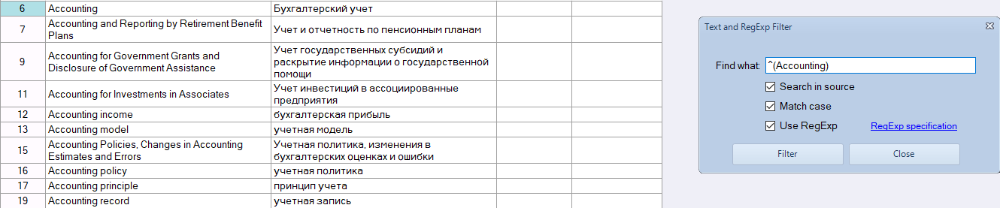

# Goldpan, a free multi-purpose linguistic software tool

We are proud and happy to share this tool with the industry, free of charge.
You do NOT have to pay anything for Goldpan - unless you want to use a couple of premium features needed only for large companies and serious projects. The core features of Goldpan are - *and will stay* - completely free.

The current version of Goldpan is 3.6.

## Why do I need Goldpan and what is it for?

Goldpan has been created for handling bilingual translation data in order to preserve the linguistic knowledge that you accumulate via the bilingual translations in your possession. With Goldpan, you can:

- convert various bilingual files to the TMX format to keep them in order locally

- work with your Translation Memory (TM) files and mine terminology from them, correct translations

- clean unwanted tags from your files in preparation for an upload into your CAT tool or TM server

- prepare TMs for training your custom MT engine

## How do I handle my TM library?

Of course, you can simply prepare and clean up your TM files for storage - locally, or on your company's file server. But that method is obsolete now!

The smart way is to store your clean TMs in a TM Cloud Server as a central source of translation knowledge for yourself and/or your organization.

Logrus Global has a suitable solution for this: **Memose**. With **Memose**, you can centralize the storage and management of TMs, perform searches across the entirety of stored TM data at once, prepare project memory for the CAT tool of your choosing, and even translate and edit `.xliff` files! If you want to try Memose, send an email to marcom @ logrusglobal.com.

## Supported Operating Systems

Currently, there is only a Windows 64-bit version of Goldpan. Windows 32, OS X or Linux compatibility is not currently planned.

Custom features may be developed for companies willing to finance their development. Otherwise, we will only implement what we feel we need to implement at our own expense. Donations are always welcome.

## Installing Goldpan

In order to install Goldpan, go to the Logrus Global Localization Cloud website (https://cloud.logrusglobal.com/) and choose Goldpan. Then click **Try it**. You will be taken to the Logrus Global Localization Cloud Dashboard.

Click the **Free Download** link on the Goldpan tile.

The latest MSI distributive file will be downloaded. Install it on your system and voila!

## Creating, opening and editing TMX and TBX files

Goldpan is an easy-to-use - but powerful - tool for creating, opening and editing multilingual translation memory (TMX) and terminology exchange (TBX) files with up to nine parallel language pairs.

Despite its simple visual interface, Goldpan has a lot of features. Some of them are not so obvious, so we'll explain them here is more detail.

### Supported formats

Goldpan supports differing sets of file formats for importing and exporting data. Some formats can be read, but not written in.

### Importing

With Goldpan, you can import translation resources from the **SDLTM**, **SDLXLIFF**, **XLIFF**, **TMX** and **TBX** file formats.

To import translation resources from a file, open the Import/Export tab and press the Import File button. In the dialog window, select a file format from the drop-down menu, then find and select the file. This operation can only import resources from a single file per use. If necessary, employ this operation multiple times to import resources from several files.

### Exporting

You can select a subset of resources for exporting into **TMX**, **XLIFF**, **TBX** or **XLSX** files.

Goldpan will only export the segments present in its clipboard, which is populated by means of the **Move to Memory** and **Copy to Memory** buttons on the **Import/Export** tab. The **Move to Memory** operation removes any highlighted segments from the editor, but the **Copy to Memory** operation leaves the segments in the editor. Segments can be highlighted through commonly used operations including clicking while holding down SHIFT or CTRL, or clicking-and-dragging. Only entire segments will be moved or copied. If a segment is visible as being partially highlighted, the entire segment will still be moved or copied. An export operation can be started with the Export button, which is located on the border between the editor area and the memory area. Alternatively, one of the buttons in the Export group on the Import/Export tab can be used. (An appropriate file format will be selected by default.)

### Color highlighting and filtering

In order to mark or filter out resources in the course of handling translation-memory data, you can mark strings with a colored highlight.

Color marking is performed using the **Color** drop-down list in the **Markup** group of the **Home** tab. When a color is selected from this list, all highlighted segments become marked with the selected color. A segment can only be marked with one color at a time and will always be marked in its entirety. (For convenience, the TU# field remains unmarked.) The **Clear Markup** option, which is also shown in the drop-down list, can be selected to clear any highlighted marked segments.

Marking-based filtering is performed using the **Color** drop-down list from the **Marked Up** group of the **Filters and Checks** tab. If any colors are selected from this list (multiple colors can be selected simultaneously), the editor will not display any segments not marked with these colors.

### Filtering

You can filter your translation resources by various criteria, such as segment status and presence of particular text fragments within cells.

The **Filters and Checks** tab elements are used for this purpose:

- The **Clear** button resets the list of filtering criteria.

- The **Status** button group is used for displaying only the new, modified or locked segments in the editor. Segments are locked or unlocked using the Protection button group in the Home tab.

- The **Marked Up** element group (see above).

- The **Search** element group is used to filter away any segments that don't contain the specified text fragment. A specific segment field, selected by means of the Field drop-down list, will be searched for the fragment entered in the Text box. If the Contains button is used to start the filtering process, the editor will display every segment that contains the text within the appropriate field. If the Equals button is used, only the segment in which the field’s content is a complete match to the text will be shown.

- The **Advanced** element group (see below).

### Find and Replace

You can use standard find-and-replace functions in the editor.

You can activate the **Search and Replace** window by pressing either `CTRL+F` or the **Search** button in the **Text Search** group of the **Home** tab.

Goldpan enables the use of regular expressions with these functions, which can be quite useful. For example, you may need to edit or remove the time codes that are present in your TM data. In that case, you'd simply run a search or replace query with the "\d\d:\d\d:\d\d\s" regular expression (for a "11:22:33" format of time codes) in the "Find what" field. The use of regular expressions is toggled via the **Use Regular expression** checkbox.

### Clearing tags

You can clean up your translation resources by removing unwanted tags of various types (including the `XML` and `RTF` tags) as well as any superfluous spaces at the start and at the end of a given text.

The **Clean** drop-down list in the **Text Cleaning** group of the Home tab is used for this purpose. Selecting any of the items on the list executes the corresponding operation for all highlighted cells:

- **Tags only** removes any angle bracket (< >) tags.

- **Tags such as { }** remove any curly bracket or other corresponding tags.

- **Trim first and last spaces** removes any unneeded spaces.

- **Clear cells** clears the cells.

If you are operating a PRO Version of Goldpan, there is now - as of Version 3.6 - another option ready for you: the **Clean tags in files** button in the Batch Tools tab. With it, you can clean up entire batches of files in a few clicks. Pressing this button calls a dialog window. There, you can set up a list of files to be cleared of tags using the **Add File** (which calls an additional dialog window for selecting one or more TMX/TBX files) and **Add TMX Dir** (which calls another window for designating entire folders) buttons. The **Clean tags**, **Clean tags like { }** and **Trim first and last spaces** checkboxes determine the method of tag-clearing to be employed, similiar to the buttons described above. After you've listed all the files and chosen the clearing method, press the CLEAN button to execute!

### QA Filtering options

You can perform basic QA checking on your translation resources, as Goldpan provides various methods of segment filtering based on source-target comparison.

The **Filter Checks** drop-down list from the Advanced group of the Filters and Checks tab is used for this purpose. It contains the following elements:

- **Source = Target** displays only the segments in which the contents of the source and target fields match.

- **Capitalization** displays only the segments in which the text in the source and target fields begins with different capitalization.

- **Leading and trailing spaces** displays only the segments with different leading and trailing spaces in their source and target fields.

- **Double spaces** displays only the segments in which the source and target fields contain different sets of double spaces.

- **Digits and numbers** displays only the segments in which the source and target fields contain different sets of digits and numbers.

- **Placeholders** displays only the segments in which the source and target fields contain different sets of placeholders (i.e., formatted printing sequences: %s, %d, %1, etc.)

- **Punctuation** displays only the segments in which the source and target fields differ in leading and trailing punctuation.

- **Relative size** displays only the segments in which the source and target fields vary greatly in the volume of text they contain.

- **Empty segments** displays only the segments in which either the source or the target field is empty.

- **Partially translated** displays only the segments in which the target field partially matches the content of the source field, pointing to partial translation.

- **Find duplicates** displays duplicate segments.

The check is performed for a single language pair, i.e. the source language and a particular target language selected from the **Ref.Pair** drop-down list.

A new element, **Text and RegExp Filter**, has been added in Version 3.5.3. It deserves a chapter of its own.

### Text and Regular Expression Filtering

The **Text and RegExp Filter** function is different from the other ones that are accessed through the **Filter Checks** drop-down list.

It displays a dialog window resembling the standard Find & Replace window. However, instead of finding or replacing individual records, this one filters out a list of all the records containing a specific string, or matching a regular expression.

We've created this function with the task of 'cleaning up TM corpi' in mind. For example, if you need to send a corpus (or a fragment of it) somewhere, for training or testing a machine translation engine, you may want to filter out all the records containing the name of your company, in order to then remove them (or to edit them, perhaps using regular expressions). In the past, it has been noted that Goldpan did not offer this capability - but it does, now!

By default, the filtering is performed through the target cell contents. The **Search in source** option enables filtering via the source cell contents. There is a **Match case** option, as well.

*Let's filter out all the records that have the word 'Accounting' in the source*

The **Use RegExp** option enables you to use regular expressions for filtering. A link to the regular expression specification at microsoft.com is provided for quick reference.

*Now let's filter out those that specifically start with this word, instead of just having it anywhere*

### Split & Merge

You can split and merge translation memory files using several criteria, in batch mode.

The **Split & Merge** group of the Batch Tools tab is used:

- The **Split** button opens a dialog window that is used to split TBX/TMX files, and the source file is selected by means of the Browse button. The size of the resulting files is determined by segment count or by file size, depending on the user's requirement. The OK button is activated when the source file and splitting method are selected.

- The **Merge** button opens a dialog window used for merging a batch of TBX/TMX files. The source language of the resulting file is selected from the Source/Admin language drop-down list or set by entering a language code. The File List element group facilitates the addition of all TMX/TBX files in a particular folder to the list (Add TMX Dir, Add TBX Dir), the addition of arbitrary files or groups of files (Add File), the removal of files from the list one by one (Delete) or the clearing of the list (Clear). The OK button becomes active when a source language is set and at least one or more files are added to the list.

### Format conversions

You can convert `XLSX` files into the `TMX`, `TBX` or `XLF` format, in batch mode.

The **Converters** group of the Batch Tools tab is used. Each of the buttons (Convert to TMX, Convert to TBX, Convert to XLF) calls a dialog window in which the user will:

- select a single XLSX file for conversion using the Browse button

- set the languages for the resulting multilingual file. Each language has to be selected from the Language drop-down list (or entered as a language code) and added to the list by means of the Add button

- set the source language by selecting it from the Primary language drop-down list or entering a language code

The OK button becomes active when a XLSX file is selected and at least two languages are added to the list.

Goldpan lets the user choose each of the resources required from various sources and then merge them into new translation-memory resource files as needed.
