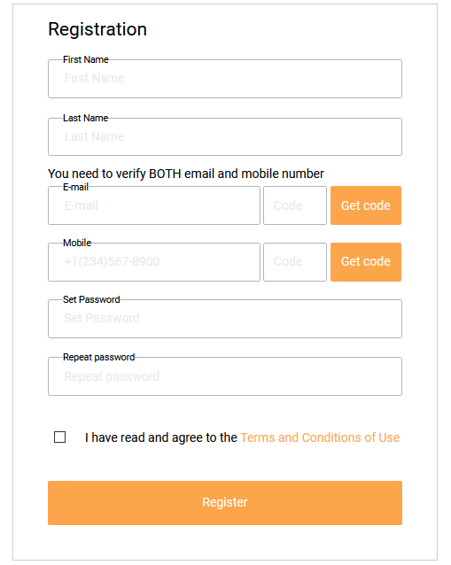
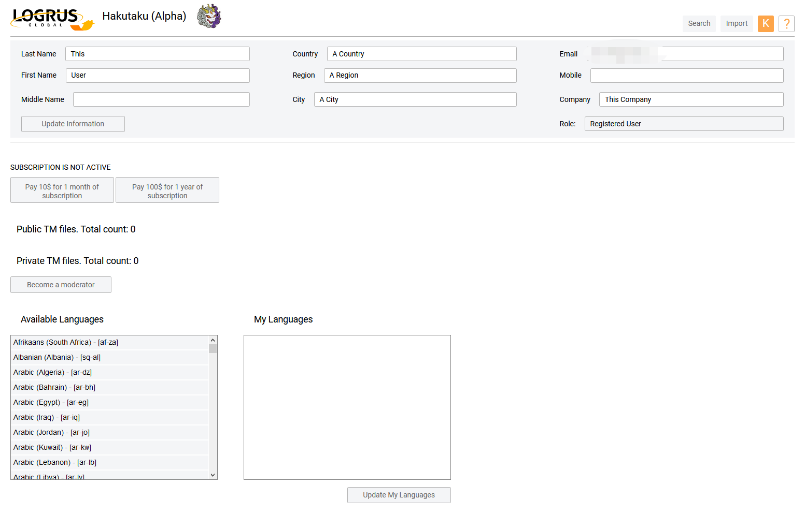
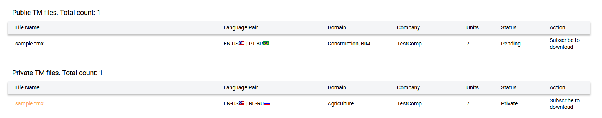
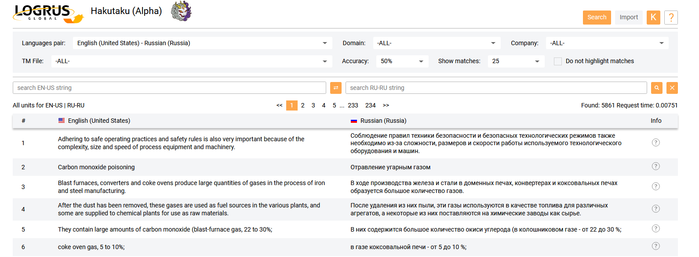
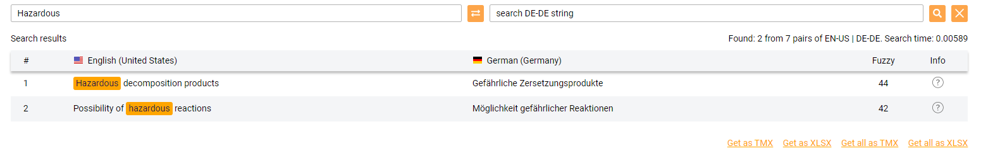
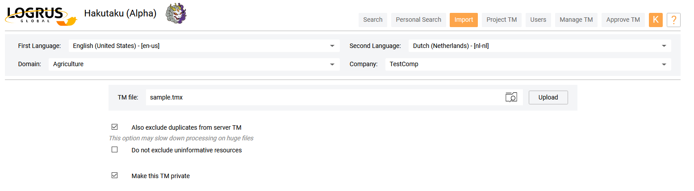
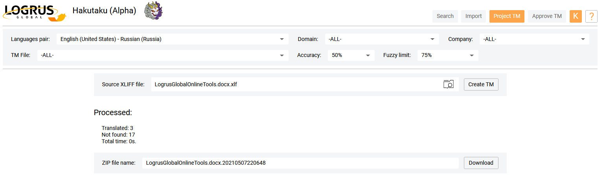
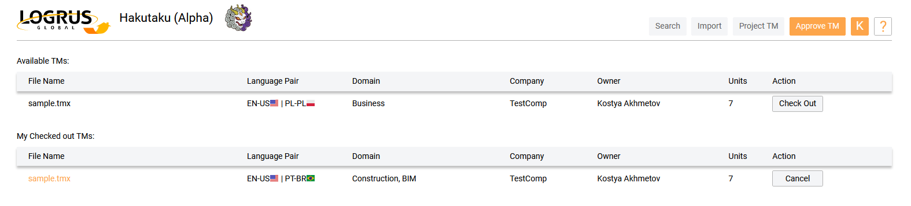
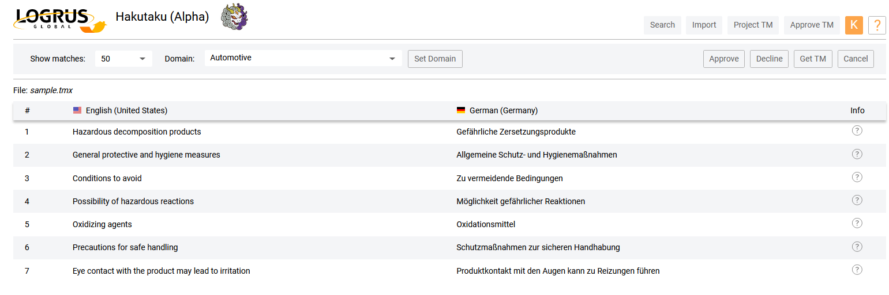

# Hakutaku — облачное хранилище памяти переводов

**Hakutaku** — это облачное решение для корпоративных и индивидуальных пользователей, предоставляющее самые широкие возможности хранения **памяти переводов (ТМ)** и управления ею. Все пользователи по умолчанию имеют бесплатный доступ к репозиторию **общественных TM**. Репозитории **приватных TM** и ряд дополнительных функций доступны по подписке.

## Преимущества Hakutaku

- Репозиторий **общественных TM** на сервере **Hakutaku** доступен для поиска в нем всем пользователям, регистрация в системе для этого не обязательна.

- Компании (например, переводческие компании и заказчики услуг перевода) и фрилансеры могут пользоваться **Hakutaku** как репозиторием **приватных TM**. Это доступная альтернатива покупке представленных на рынке серверов ТМ корпоративного класса. **Приватные TM** недоступны другим пользователям. В этом режиме **Hakutaku** является приватным **сервером TM** с функциями поиска по конкордансу и создания **проектной TM** под конкретный набор исходных файлов.

- Компании и фрилансеры с потребностями в **TM с общим доступом** могут воспользоваться репозиторием **общественных TM** для пополнения этих **ТМ** своими отраслевыми массивами **TM**, накопления информации и создания проверенных специализированных баз данных с переводами по различным тематикам, включая информационное моделирование в строительстве (BIM), медицину, спорт и другие темы.

- Общественные некоммерческие организации могут хранить свои **TM** в общественном репозитории, что позволяет ускорить переводы для общественных нужд и повысить их качество.

- У фрилансеров появляется новая возможность по диверсификации своих услуг — пополнение репозиториев тематических **приватных TM** по заказу компаний.

- Ученые и разработчики получат чистые и релевантные наборы данных **TM** для тренировки лучших систем машинного перевода.

## Пользовательские роли

В **Hakutaku** предусмотрены различные роли пользователей. Например, поиск по **общественной TM** можно выполнять без регистрации пользовательской учетной записи. Преимуществом регистрация является доступ к дополнительным функциям системы. Но самый широкий набор функций доступен по подписке, в том числе репозиторий **приватных TM** и возможность создавать **проектные TM**.

Публикации в репозиторий **общественных TM** проходят обязательную модерацию. Модераторы набираются из числа добровольцев и работают бесплатно на общественных началах. Каждый зарегистрированный пользователь может подать заявку на роль **External Moderator (Внешний модератор)** с возможностью вырасти в дальнейшем до уровня **Reliable Moderator (Доверенный модератор)**.

|  | Unregistered User (незарегистрированный пользователь) | Registered User (зарегистрированный пользователь) | Paid User (платный пользователь) | External Moderator (внешний модератор) | Reliable Moderator (доверенный модератор) |
| --------------- | -------------------- | ------------------------- | ----------- | ----------- | ----------- |
| Поиск | только поиск | только поиск | выгрузка поиска в виде ТМ | выгрузка поиска в виде ТМ | выгрузка поиска в виде ТМ |
| Проектная ТМ | нет | нет | полный доступ | ограниченный доступ | ограниченный доступ |
| Импорт ТМ | нет | импорт < 10МБ | импорт ТМ любого объема | импорт < 100МБ | импорт < 100МБ |
| Пользователи | нет | нет | нет | нет | нет |
| Управление TM | нет | нет | нет | нет | нет |
| Утверждение TM | нет | нет | нет | Выполняется на личной странице утверждения ТМ с языковым фильтром и личной таблицей заданий | Выполняется на личной странице утверждения ТМ с языковым фильтром и личной таблицей заданий |
| Страница утверждения | нет | нет | нет | Доступ без возможности экспорта ТМ | Доступ с возможностью экспорта ТМ |
| Страница профиля | нет | страница профиля доступна | страница профиля доступна | страница профиля доступна | страница профиля доступна |
| Приватная TM | нет | нет | доступна | нет | нет |

## Регистрация

Система **Hakutaku** открыта для всех, но импорт данных в **общественную TM** или возможность подать заявку на роль модератора доступны только для зарегистрированных пользователей. Нажмите кнопку **Login (Вход)**, а затем - кнопку **Registration (Регистрация)** на экране **Login (Вход)**. Необходимо указать имя, фамилию, адрес электронной почты и номер мобильного телефона. Почта и телефон будут проверены посредством отправки специальных кодов. Необходимо также прочитать **Terms and Conditions of Use (Условия использования)**, принять их, а затем создать свой пароль.

## Управление учетной записью и подпиской

После входа в систему пользователю доступная личная учетная запись. Ее можно открыть с помощью кнопки в верхнем правом углу экрана — на кнопке отображается первая буква адреса эл. почты. На странице учетной записи находятся личные данные пользователя: имя, адрес, эл. почта, компания и номер телефона, пользовательская роль. Здесь можно оплатить подписку, выбрать свои рабочие языковые пары, отправить заявку на роль модератора.

Оплатить новую подписку или продлить действующую подписку можно либо на 1 месяц (стоимость $10), либо на 1 год (стоимость $100). По нажатию соответствующей кнопки открывается экран оформления платежа.

Для отправки заявки на роль модератора необходимо заполнить все поля личных данных (исключая необязательное поле **Middle Name (Отчество)**). Для роли модератора подписка не требуется. Заявки на роль модератора рассматриваются пользователями с ролью **Administrator (Администратор)**.

После загрузки любых файлов **TM** в общественный или приватный репозиторий **TM** эти файлы добавляются в список файлов на вкладке **Account Management (Управление учетными записями)**. Для файлов общественных **TM** статус их утверждения отображается в столбце **Status (Статус)**. Пользователи с подпиской могут скачивать такие файлы в любое время.

## Интерфейс пользователя

Интерфейс пользователя **Hakutaku** содержит пять основных вкладок, доступных пользователям и модераторам: **Search (Поиск)**, **Personal Search (Приватный поиск)**, **Import (Импорт)**, **Project TM (Проектная ТМ)**, **Approve TM (Утверждение ТМ)**. Доступ к этим вкладкам зависит от роли пользователя, подробности см. в таблице **Пользовательские роли**.

### Вкладка "Search (Поиск)"

На этой вкладке выполняется поиск по **общественным TM**. В верхней части экрана находятся поисковые фильтры в виде раскрывающихся меню. С их помощью можно выбрать языковую пару, тематику, компанию, конкретный файл **общественной TM**, степень строгости поиска, а также количество результатов поиска, отображаемых на одной странице. Пункт меню "-ALL-(Все)" расширяет область поиска до всех тематик, файлов **TM** и компаний, имеющихся в базе данных. После установки фильтров введите поисковую фразу на исходном языке или языке перевода в соответствующем текстовом поле. Результаты поиска обновляются каждый раз при выборе какого-либо пункта в раскрывающихся меню, по нажатию клавиши ENTER после ввода в текстовое поле, а также по нажатию кнопки **Search (Поиск)**. Кнопка между двумя текстовыми полями меняет направление перевода в текущей языковой паре. Кнопка в виде "крестика" сбрасывает результаты поиска.

Если навести указатель на значок **(?)** в столбце **Info (Сведения)** любой записи в результатах поиска, отображается подсказка с подробными сведениями о текущей записи с указанием тематики, компании, исходного файла **TM** и владельца (пользователя, который импортировал эту запись в **общественную TM**).

Платная подписка позволяет скачивать результаты поиска. Ссылки для скачивания результатов в виде **TM** в форматах TMX и XLSX появляются под списком результатов после завершения выполнения поискового запроса.

### Вкладка "Personal Search (Приватный поиск)"

Доступ: только по подписке.

Этот вид поиска отличается от поиска на вкладке **Search (Поиск)** тем, что поиск выполняется по репозиторию **приватных TM** данного пользователя, а не по общественному репозиторию.

### Вкладка "Import (Импорт)"

Доступ: только для зарегистрированных пользователей.

Здесь можно импортировать файлы **TM** в общественный репозиторий **Hakutaku**, либо (при наличии подписки) в свой приватный репозиторий. Поддерживаются следующие форматы файлов импорта: TMX, TSV, HTM, XLSX.

Перед импортом файла **TM** необходимо выбрать языковую пару, тематику и компанию. Тематика выбирается из фиксированного списка, имя компании можно выбрать или добавить новое.

Импорт настраивается более тонко с помощью флажков:

- Параметр "Also exclude duplicates from server TM (Также исключить дубликаты из серверной ТМ)" означает, что после утверждения нового файла модератором из существующих файлов **общественной TM** будут удалены все записи-дубликаты.

- Параметр "Do not exclude uninformative resources (Не исключать неинформативные ресурсы)" снимает запрет на импорт записей, содержимое которых отличается от традиционной памяти переводов.

- Параметр "Make this TM private (Сделать данную ТМ приватной)" доступен только по подписке. Загруженный файл **TM** образует приватную ТМ, которая доступна только загрузившему ее пользователю и не является частью общественной ТМ. При активации также опции удаления дубликатов эта приватная **TM** заодно избавляется от дублирующихся записей.

После задания параметров импорта следует выбрать загружаемый файл и нажать кнопку **Upload (Загрузить)**. Система распознает исходный и конечный языки в импортируемом файле и предлагает подтвердить выбранную языковую пару. По завершении загрузки можно скачать файл журнала, содержащий статистику по выполненной загрузке: количество добавленных записей, удаленных дубликатов, исключенных неинформативных ресурсов, а также потраченное на загрузку время.

Размер загружаемых файлов **TM** ограничен. Зарегистрированные пользователи могут импортировать файлы размером не более 10 МБ, а модераторы — 100 МБ. Для пользователей с подпиской ограничений по размеру файлов нет.

После загрузки файла для **общественной TM** он попадает сначала в "карантин", где ожидает утверждения модератором, чтобы затем быть опубликованным как часть **общественной TM**. Пользователь, отправивший файл на загрузку, получает уведомление по эл. почте об утверждении или отклонении этого файла модератором.

### Вкладка "Project TM (Проектная ТМ)"

Доступ: только для пользователей с подпиской и модераторов.

Здесь можно преобразовать список терминов в файл памяти переводов для конкретного языка, например для использования в сторонней CAT-системе. Основная функция данной вкладки — создать файл **TM** путем выбора из общественной ТМ ресурсов, содержащих термины из предоставленного пользователем списка в формате файла XLIFF.

Выберите языковую пару и при необходимости ограничьте область поиска терминов с помощью параметров  **Domain (Тематика)**, конкретный файл общественного репозитория **TM File (Файл ТМ)**, **Company (Компания)**, **Accuracy (Строгость)** and **Fuzzy limit (Уровень фаззи)**. Затем загрузите файл XLIFF с искомой терминологией и нажмите кнопку **Create TM (Создать ТМ)**.

По завершении поиска нажмите кнопку **Download (Скачать)**. Вы получите архивированный файл, содержащий сам файл **проектной TM** в формате XLSX, два служебных файла XLSX (файл с исходными терминами, которых не удалось найти в общественном репозитории, и файл статистики), а также исходный файл XLIFF.

### Вкладка "Approve TM (Утверждение ТМ)"

Доступ: только для пользователей, утвержденных на роль **External Moderator (Внешний модератор)** или **Reliable Moderator (Доверенный модератор)**.

Здесь можно проверить любые файлы **TM**, которые были отправлены на загрузку в общественный репозиторий.

На этой вкладке есть два списка: **Available TMs (Доступные ТМ)** и **My Checked Out TMs (Забронированные мной ТМ)**. В первом списке отображаются все поданные на загрузку файлы **TM**, языковые пары которых имеются в наборе языков в **профиле** модератора. Отображаются только те файлы, которые еще не были забронированы другими модераторами. Чтобы забронировать файл, нажмите кнопку **Check Out (Забронировать)** в столбце **Action (Действие)**. Каждый раз, когда модератор сам бронирует файл **TM**, либо файл назначается ему **администратором**, модератор получает уведомление по эл. почте с описанием файла и ссылкой на вкладку **Approve TM (Утверждение ТМ)**.

После бронирования файл перемещается в таблицу **My Checked Out TMs (Мои забронированные ТМ)** и перестает быть доступным другим модераторам. К каждому имени файла в этой таблице привязана гиперссылка, ведущая на экран **Approve View (Утверждение)**. На этом экране отображается все содержимое файла **TM**. Его следует оценить и принять решение об утверждении или отклонении данного файла. При необходимости можно поправить указанную для файла тематику. Для этого служат раскрывающееся меню **Domain (Тематика)** и кнопка **Set Domain (Задать тематику)**. Когда окончательное решение принято, нажмите кнопку **Approve (Утвердить)** или **Decline (Отклонить)**. Пользователи с ролью **Reliable Moderator (Доверенный модератор)** имеют доступ к кнопке **Get TM (Скачать ТМ)**. Эта кнопка позволяет скачать рецензируемую **TM** в виде файла формата TMX и подвергнуть его более тщательному анализу с помощью сторонних инструментов.

Забронированный **файл TM** можно снять с брони и вернуть в список без утверждения или отклонения с помощью кнопки **Cancel (Отмена)** на экране **Approve View (Утверждение)**, на главном экране вкладки **Approve TM (Утверждение ТМ)** или в столбце **Action (Действие)** таблицы **My Checked Out TMs (Мои забронированные ТМ)**.
