# Interpretisto: платформа синхронного перевода

**Interpretisto** — это программная платформа видеоконференцсвязи и удаленного синхронного перевода для проведения телеконференций и массовых онлайн- и выездных мероприятий с синхронным переводом.

Платформа предлагает повышенную безопасность и конфиденциальность, так как не использует никакие публичные или сторонние сервисы удаленного синхронного перевода (RSI).

- Сервис коммуникации «два в одном»: видеоконференцсвязь + удаленный синхронный перевод (SRI, VRI).
- Безопасность: никакие публичные сервисы RSI не применяются. Платформа построена на RSI-сервере и его обвязке собственной разработки и может быть установлена на одном компьютере в защищенной сети предприятия заказчика. Аудио- и видеоданные не отправляются ни на один общедоступный сервер.
- Простота использования: участнику конференции с любой ролью нужен только веб-браузер. Не требуется установка никаких программ для настольного компьютера или мобильных приложений для смартфона. В браузере реализован весьма гибкий интерфейс пользователя, одинаково удобный для пользователей с самыми разными ролями.
- Функции связи: участникам конференции можно по электронной почте отправлять ссылки на виртуальные конференц-залы **Interpretisto** с датой и временем запланированного мероприятия. Участникам доступны общий чат, демонстрация экрана и выбор языка синхронного перевода.
- Синхронный перевод: платформа обеспечивает многоканальную потоковую передачу звука для поддержки синхронного перевода на несколько языков параллельно. Виртуальное рабочее место синхрониста оснащено стандартными элементами управления. Переводчики видят и слышат все, что происходит на конференции, включая общение участников в чате вебинара или конференции.

## Роли участников конференции

**Interpretisto** поддерживает разделение ролей участников конференции. Для каждой роли автоматически создаются отдельные ссылки и коды для подключения к конференции.

- Докладчик (Presenter): роль выступающего на конференциях типа вебинара ([см. функции](http://logrus.pro/#/interpretisto?id=Роль-quotДокладчик-presenterquot)).
- Участник (Participant): роль полноправного участника на конференциях типа совещаний ([см. функции](http://logrus.pro/#/interpretisto?id=Роль-quotУчастникquot-participant)).
- Переводчик (Interpreter): роль устного переводчика, необходимого на любой международной конференции ([см. функции](http://logrus.pro/#/interpretisto?id=Роль-quotПереводчикquot-interpreter)).
- Слушатель (удаленный) (Attendee (Event Remote)): роль для участников онлайн-конференций типа вебинара ([см. функции](http://logrus.pro/#/interpretisto?id=Роль-quotСлушатель-удаленныйquot-attendee-event-remote)).
- Слушатель (в зале) (Attendee (Event Local)): роль для участников международных конференций с физическим присутствием на мероприятии ([см. функции](http://logrus.pro/#/interpretisto?id=Роль-quotСлушатель-в-залеquot-attendee-event-local)).
- Менеджер конференций (Conference Manager): роль управляющего одной или несколькими конференциями ([см. функции](http://logrus.pro/#/interpretisto?id=Роль-quotМенеджер-конференцийquot-conference-manager)).

## Технические требования

В **Interpretisto** разные роли пользователей отличаются требованиями к скорости канала подключения и программному и аппаратному оснащению рабочего места:

| Роль | Исх/входящая скорость подключения | Веб-браузер | Видеокамера | Микрофон | Гарнитура | Тип устройства |
| --------------- | -------------------- | ------------------------- | ----------- | ----------- | ----------- | ------------------ |
| Участник | 5 Мбит/с или выше | Firefox 60+ или Chrome 74+ | опция | требуется | требуется | ПК, ноутбук или смартфон |
| Слушатель (удаленный) | 5 Мбит/с или выше | Firefox 60+ или Chrome 74+ | не нужно | не нужно | требуется | ПК, ноутбук или смартфон |
| Докладчик | 5 Мбит/с или выше | Firefox 60+ или Chrome 74+ | требуется | требуется | не нужно | ПК или ноутбук |
| Переводчик | 10 Мбит/с или выше\* | Firefox 60+ или Chrome 74+ | опция | требуется | требуется | ПК или ноутбук |
| Слушатель (в зале) | 5 Мбит/с или выше | Firefox 60+ или Chrome 74+ | не требуется | не требуется | Required | смартфон |

\* *проводное подключение крайне желательно для более стабильной связи*

Подключите свои гарнитуру и видеокамеру и разрешите браузеру доступ к этим устройствам до входа в систему **Interpretisto**.  Рекомендуется расположиться в тихом месте без фоновых шумов, с хорошим освещением в случае использования видеокамеры для стрима. Всегда выключайте микрофон, когда вы не говорите сами.

## Подключение к Interpretisto

1. Для подключения к конференции откройте в браузере присланную вам ссылку Interpretisto.
2. Либо на сайте http://interpretisto.logrusglobal.com введите код конференции и нажмите кнопку **Join Conference**.

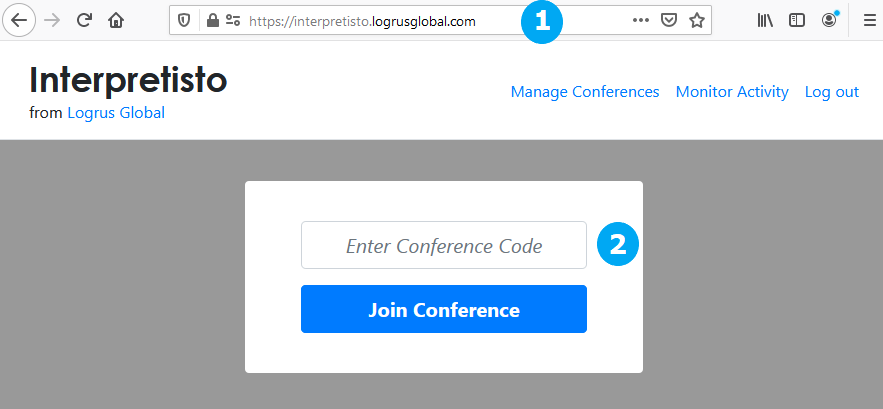

Участники с ролью **Докладчик (Presenter)** или **Слушатель (в зале) (Attendee (Event Local))** смогут войти в конференцию немедленно.

Участникам с ролью **Участник (Participant)**, **Переводчик (Interpreter)** или **Слушатель (удаленный) (Attendee (Event Remote))** предлагается окно подключения к конференции:

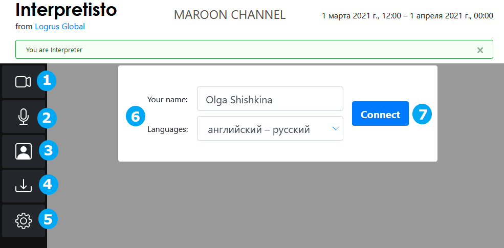

Здесь перед подключением можно настроить различные параметры и функции конференции, доступные для данной роли, такие как стриминг аудио и видео (1, 2), вид камеры (3), дополнительные материалы (4) и меню опций (5).

Участники с ролью **Участник (Participant)** или **Переводчик (Interpreter)** должны ввести свое имя (6) перед подключением. А переводчик должен также выбрать языковую пару.

По завершении настройки нажмите кнопку **Connect** (7) для входа в конференцию.

## Функции программы

Функции **Interpretisto** отличаются в зависимости от роли пользователя. Роль определяет, какие потоки данных может получать или отправлять пользователь.

**Interpretisto** отличается адаптивным интерфейсом пользователя, который гибко подстраивается под возможности устройства пользователя и его  программное обеспечение, а также настройки конференции. Если у устройства отсутствует веб-камера или иной источник видео, кнопка **Video Streaming** не отображается, даже если роль данного пользователя разрешает ему передачу видеоряда. Аналогично, если конференции не назначены никакие пары языков, то есть синхронный перевод не требуется, кнопка **Turn interpretation on/off** не отображается. А при отсутствии приложенных к конференции дополнительных материалов не показывается кнопка **Download additional materials**.

### Роль "Докладчик" (Presenter)

**Докладчик (Presenter)** может передавать видео и аудио, а также транслировать для всех содержимое своего экрана.

Доступны дополнительные материалы конференции (если они приложены) посредством кнопки **Download additional materials**.

Переключатель **On Air** запускает презентацию докладчика и передачу видео- и аудиопотока.

**Докладчику (Presenter)** доступны следующие возможности:

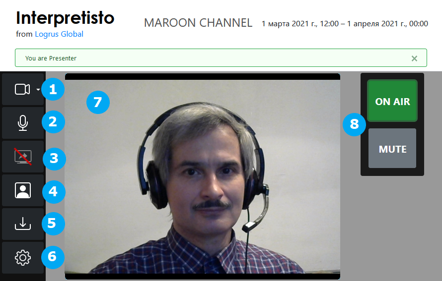

1. *Включение-выключение передачи видео и выбор источника видеосигнала*
2. *Включение-выключение передачи аудио*
3. *Включение-выключение трансляции экрана*
4. *Включение-выключение панели "Видео с моей камеры"*
5. *Скачать дополнительные материалы*
6. *Меню "Настройки" (Options)*
7. *Окно видеотрансляции*
8. *Переключатели "В эфире" (On Air) и "Выключить микрофон" (Mute)*

### Роль "Участник" (Participant)

По умолчанию **Участник (Participant)** может:

- передавать свои аудио и видео;
- транслировать свой экран;
- видеть и слышать, что передают или транслируют другие участники с ролями **Участник (Participant)** или **Докладчик (Presenter)**;
- общаться в чате.

Если для конференции разрешен синхронный перевод, можно выбрать предпочтительный язык, чтобы слышать синхронный перевод для этого языка. Остальные аудиопотоки будут приглушены на 30% по умолчанию, чтобы перевод было лучше слышно. Приглушение можно регулировать в меню **Options**. Когда синхронный переводчик для соответствующей пары языков выходит в эфир, загорается зеленая лампочка на кнопке **Turn interpretation on/off**.

Доступны дополнительные материалы конференции (если они приложены) посредством кнопки **Download additional materials**.

**Участнику (Participant)** доступны следующие возможности:

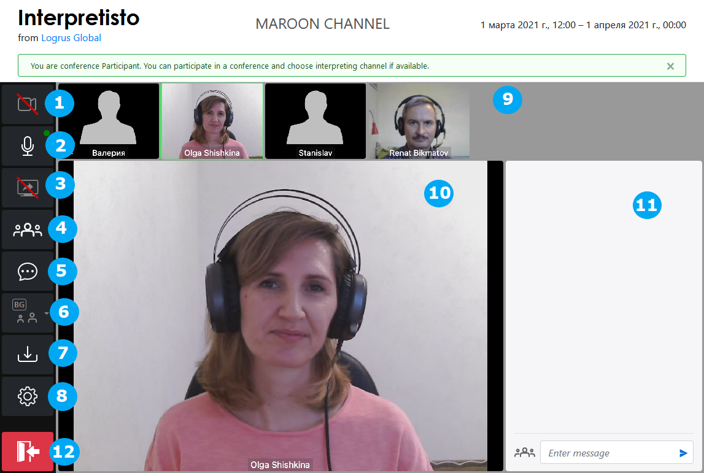

1. *Включение-выключение передачи видео и выбор источника видеосигнала (на представленном снимке экрана пользователь не располагает источниками видеосигнала, поэтому передача видео отключена, а кнопка My Camera View On/Off неактивна)*
2. *Включение-выключение передачи аудио*
3. *Включение-выключение трансляции экрана*
4. *Включение-выключение панели "Участники"*
5. *Показать-скрыть окно чата*
6. *Включение-выключение перевода и выбор языка перевода*
7. *Скачать дополнительные материалы*
8. *Меню "Настройки" (Options)*
9. *Панель "Участники"*
10. *Панель текущего выступающего*
11. *Окно чата*
12. *Кнопка выхода из конференции*

### Роль "Переводчик" (Interpreter)

Пользователь с ролью **Переводчик (Interpreter)** может видеть (только активного в данный момент докладчика) и слышать, что передают другие участники с ролями **Участник (Participant)** или **Докладчик (Presenter)**.

Речь переводчика передается по отдельному каналу. Переводчика слышат только те пользователи с ролями **Участник (Participant)** или **Слушатель (Attendee)**, которые выбрали соответствующий язык перевода, а также другие переводчики данной пары языков.

Доступен чат.

Переводчики в одной паре языков могут приватно беседовать между собой. Они слышат и видят друг друга и могут общаться в приватном чате, доступном только переводчикам в данной паре языков.

Переключатель **On Air** сигнализирует о готовности рабочего места переводчика к началу перевода и передаче звукового потока.

Доступны дополнительные материалы конференции (если они приложены) посредством кнопки **Download additional materials**.

**Переводчику (Interpreter)** доступны следующие возможности:

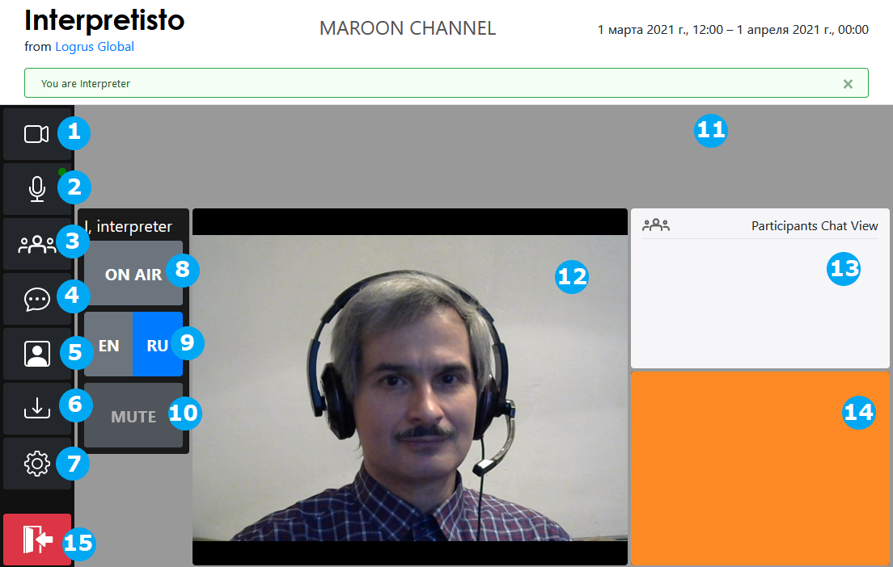

1. *Включение-выключение передачи видео и выбор источника видеосигнала*
2. *Включение-выключение передачи аудио*
3. *Показать-скрыть панель переводчика*
4. *Показать-скрыть окно чата*
5. *Включение-выключение панели "Видео с моей камеры"*
6. *Скачать дополнительные материалы*
7. *Меню "Настройки" (Options)*
8. *Переключатель "В эфире" (On Air)*
9. *Выбор языка перевода*
10. *Выключить микрофон (Mute)*
11. *Панель переводчика*
12. *Текущий докладчик*
13. *Окно чата*
14. *Панель "Видео с моей камеры" (отображается, когда переключатель My Camera View находится в положении ON)*
15. *Кнопка выхода из конференции*

### Роль "Слушатель (удаленный)" (Attendee (Event Remote))

Пользователь с ролью **Слушатель (удаленный) (Attendee (Event Remote))** может видеть и слышать, что передают другие участники с ролями **Участник (Participant)** или **Докладчик (Presenter)**, а также следить за чатом.

Если на конференции организован синхронный перевод, слушатель может выбрать предпочтительный язык, чтобы слышать синхронный перевод для этого языка. Остальные аудиопотоки будут приглушены на 30% по умолчанию, чтобы перевод было лучше слышно. Приглушение можно регулировать в меню **Options**. Когда синхронный переводчик для соответствующей пары языков выходит в эфир, загорается зеленая лампочка на кнопке **Turn interpretation on/off**.

Доступны дополнительные материалы конференции (если они приложены) посредством кнопки **Download additional materials**.

**Слушателю (удаленному) (Attendee (Event Remote))** доступны следующие возможности:

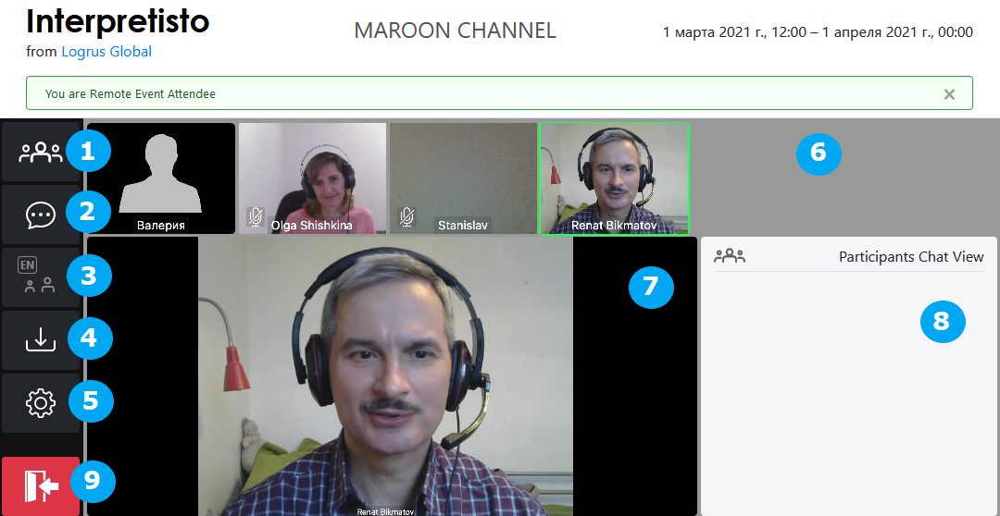

1. *Показать-скрыть панель участника*
2. *Показать-скрыть окно чата*
3. *Включение-выключение перевода и выбор языка перевода*
4. *Скачать дополнительные материалы*
5. *Меню "Настройки" (Options)*
6. *Панель участника*
7. *Текущий докладчик*
8. *Окно чата*
9. *Кнопка выхода из конференции*

### Роль "Слушатель (в зале)" (Attendee (Event Local))

Пользователь с ролью **Слушатель (в зале) (Attendee (Event Local))** может только слушать переводчиков на выбранный им язык.

**Слушателю (в зале) (Attendee (Event Local))** доступны следующие возможности:

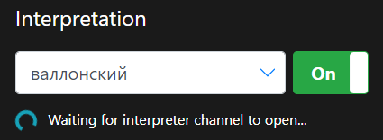

1. *Выбор языка перевода*
2. *Включение-выключение перевода*

### Роль "Менеджер конференций" (Conference Manager)

**Менеджер конференций (Conference Manager)** может задавать параметры доступных ему конференций. Как это делается, описано ниже.

По ходу конференции **Менеджер конференций (Conference Manager)** может выключать микрофоны у всех участников (кнопка **Mute All** (1)) и выборочно включать микрофоны любых участников (кнопка **Unmute** (2)). Таким образом конференцию легко преобразовать в вебинар с одним или несколькими выступающими, у которых включены микрофоны.

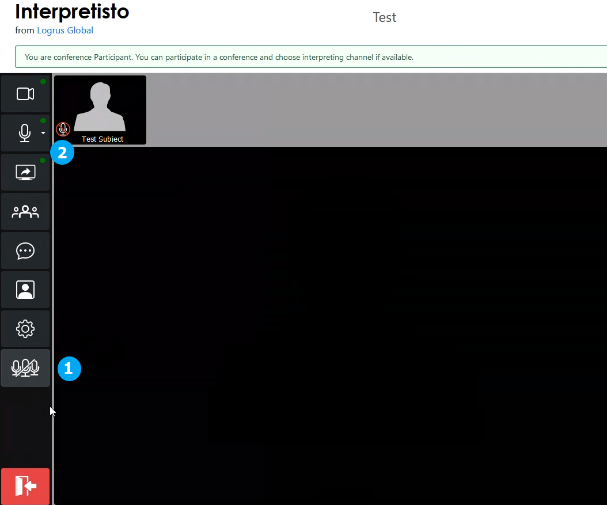

## Управление конференциями

Средства управления конференциями интуитивно понятны. При наличии соответствующих прав для доступа к странице управления щелкните ссылку **Manage Conferences** в верхнем правом углу экрана.

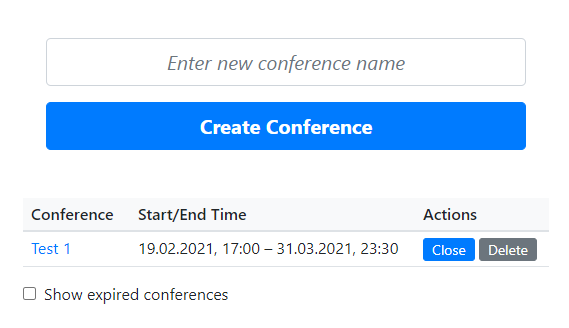
*Экран параметров управления*

Здесь можно создать конференцию — введите ее название в текстовом поле и нажмите кнопку **Create Conference**. Если в системе уже есть ранее созданные конференции, их можно редактировать. Для этого щелкните название нужной конференции. Конференции можно также закрывать или удалять с помощью соответствующих кнопок.

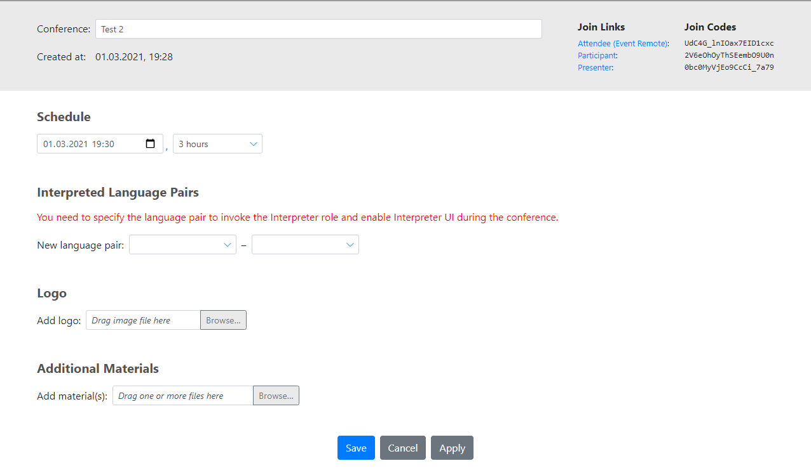
*Экран редактирования*

Экран редактирования позволяет управлять всеми возможностями конференций:

- в любое время задавать или менять название (в верхней секции);
- задавать интервал времени, когда конференция доступна (в разделе **Schedule**);
- задавать одну или несколько пар языков перевода - любое количество (в разделе **Interpreted Language Pairs**);
- загружать изображение в качестве эмблемы, которое все приглашенные увидят в верхнем правом углу окна конференции (в разделе **Logo**);
- загружать любые файлы для раздачи участникам (исключая пользователей с ролью **Слушатель (в зале) (Attendee (Event Local))**) (в разделе **Additional Materials**);

В верхнем правом углу экрана находится список ссылок и кодов доступа к конференции. Они автоматически создаются отдельно для каждой роли в данной конференции. При этом роли **Слушатель (в зале) (Attendee (Event Local))** и **Переводчик (Interpreter)** активируются только для конференций с выбранными языками перевода.

### Типы конференций

С помощью программы Interpretisto можно создавать конференции самых разных типов. Строгих ограничений тут нет, приведем для примера варианты:

- конференция в стиле "совещание" с равноправными участниками с ролью **Участник (Participant)**;
- конференция равноправных участников с ролью **Участник (Participant)** и несколькими приглашенными устными переводчиками с ролью **Переводчик (Interpreter)**;
- вебинар с одним выступающим с ролью **Докладчик (Presenter)**, неким количеством посетителей с ролью **Слушатель (Attendee)** и при необходимости — приглашенными устными переводчиками с ролью **Переводчик (Interpreter)**;
- гибридное совещание-вебинар с участием пользователей с ролями **Слушатель (Attendee)** и **Участник (Participant)**.

## Использование надстройки для MS Outlook

Функционал планирования конференций **Interpretisto** доступен в почтовой  программе **Microsoft Outlook** в виде надстройки.

Для установки этой надстройки скачайте установочный пакет, закройте программу Outlook и запустите скачанный установщик. В дальнейшем будет разработан более простой процесс установки по сети. Для работы надстройки требуется пакет .NET Framework версии 4.6 или более новой (в системе Microsoft Windows 10 этот пакет уже установлен по умолчанию).

После успешной установки надстройки **Interpretisto** в меню **Новые элементы** появится новый пункт **Interpretisto** - и в представлении **Почта**, и в представлении **Календарь**:

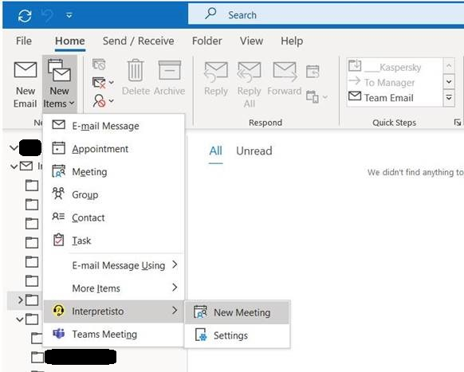

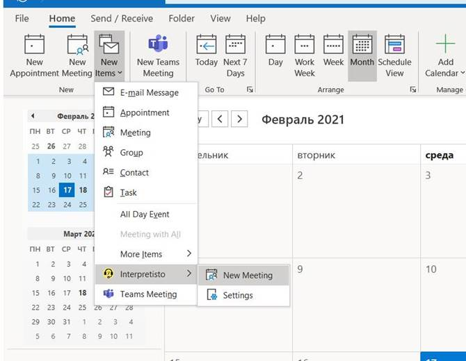

Этот пункт открывает подменю, содержащее пункты **New Meeting (Новая конференция)** и **Settings (Настройки)** items. Первый раз при выборе пункта меню **New Meeting (Новая конференция)** после установки надстройки потребуется настроить подключение к серверу **Interpretisto**:

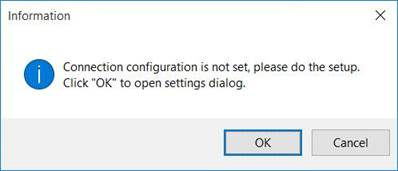

Изначально поля **Server Address (Адрес сервера)** и **ID Server (ИД сервера)** содержат значения по умолчанию, а поле **Login (Имя)** содержит текущий адрес электронной почты пользователя программы **Outlook**. Введите адрес эл. почты и пароль, ранее установленные для вашей учетной записи в облаке Logrus Global Localization Cloud, затем нажмите кнопку **Save (Сохранить)** для завершения настройки подключения к нашим серверам:

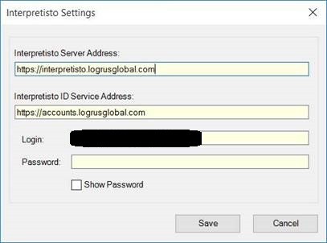

Когда подключение будет настроено, еще раз выберите пункт меню **New Meeting (Новая конференция)** для создания новой конференции. Появится окно с текстом приглашения и ссылкой по умолчанию. Заполните все обязательные поля и с помощью кнопки **Send (Отправить)** добавьте конференцию в календарь. При этом участникам конференции будут отправлены реквизиты для подключения к ней, а на сервере **Interpretisto** будет создана новая конференция с указанными вами датой и названием:

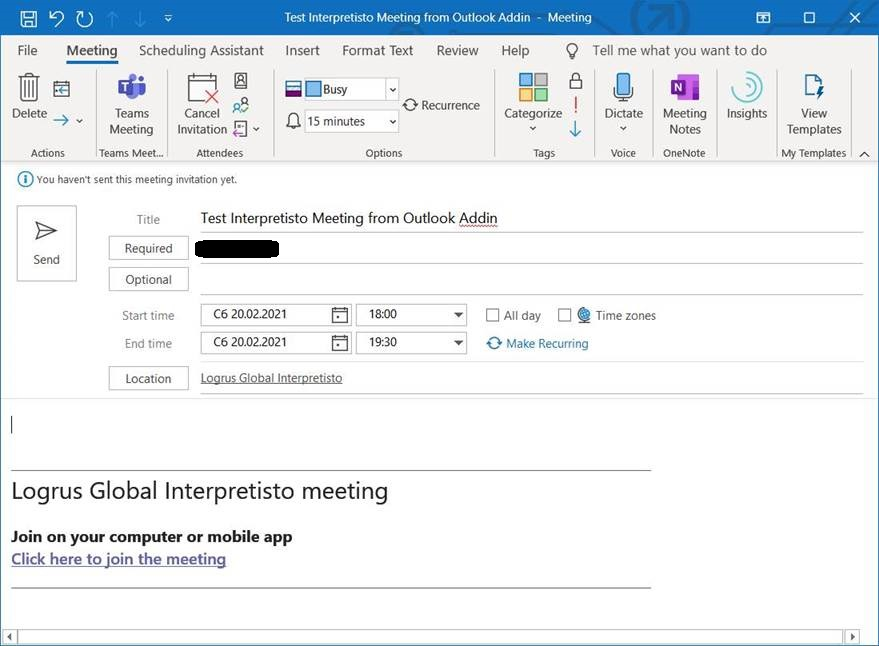

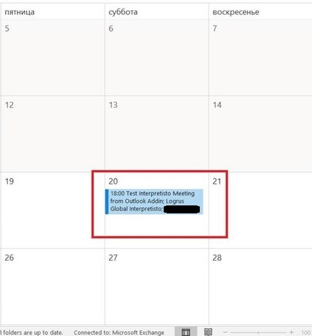

Новая конференция появится на экране **Manage Conferences (Управление конференциями)** в **Interpretisto**:

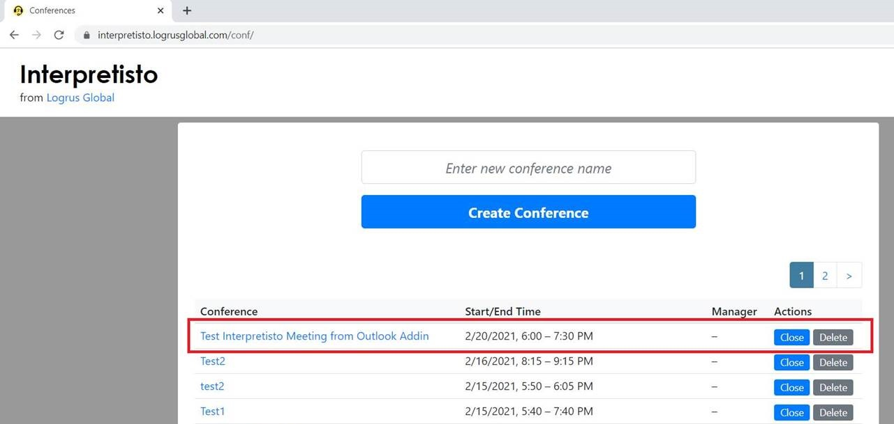

Параметры конференции можно изменить прямо на этом экране, либо в календаре **Outlook**. Для этого дважды щелкните соответствующую запись:

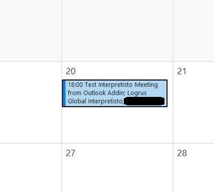

Откроется форма для редактирования параметров конференции. С помощью кнопки **Send Update (Отправить обновление)** нужно обновить данные на сервере **Interpretisto** и запустить рассылку уведомлений участникам этой конференции:

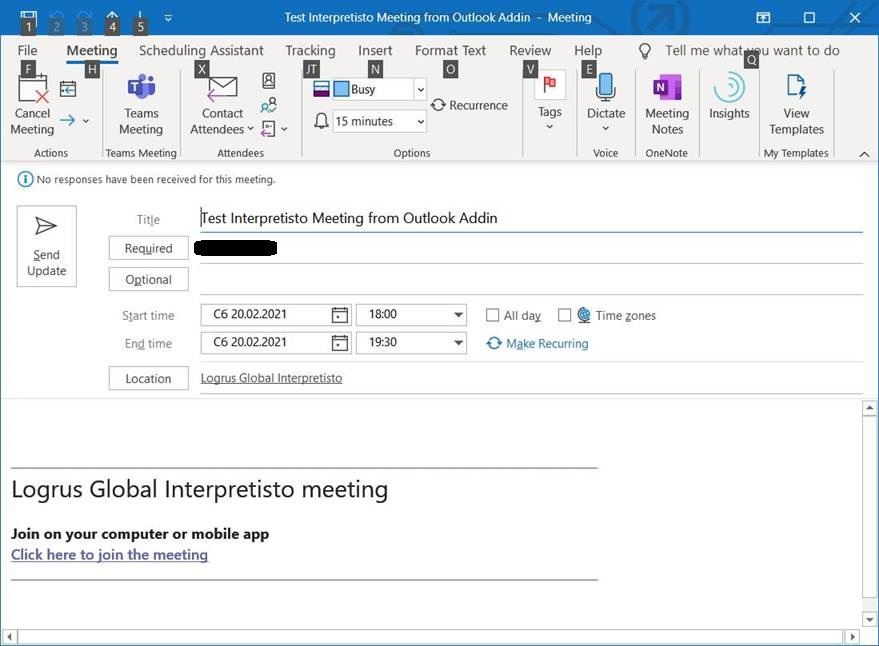

Для отмены конференции имеется соответствующая форма. В календаре **Outlook** эта форма открывается через контекстное меню (открывается правой кнопкой мыши) с помощью команды **Cancel Meeting (Отменить конференцию)**:

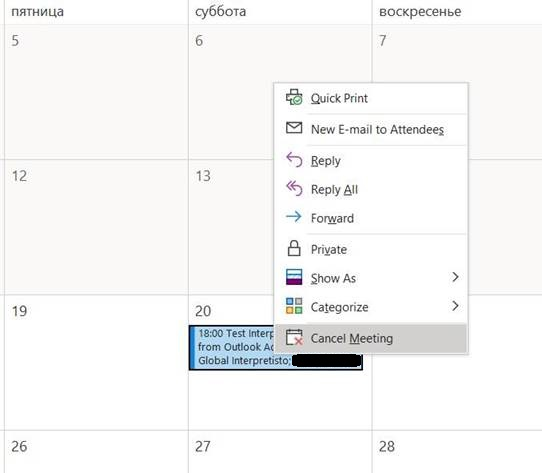

Для подтверждения удаления конференции нажмите кнопку **Send Cancellation (Отправить отмену)** в этой форме. После этого конференция будет удалена из календаря и с сервера **Interpretisto**:

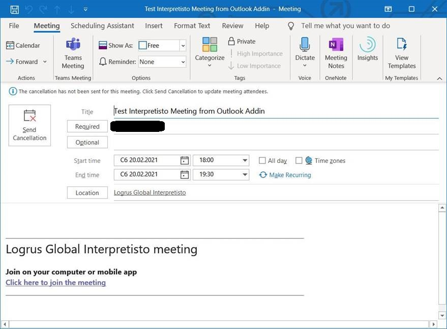
