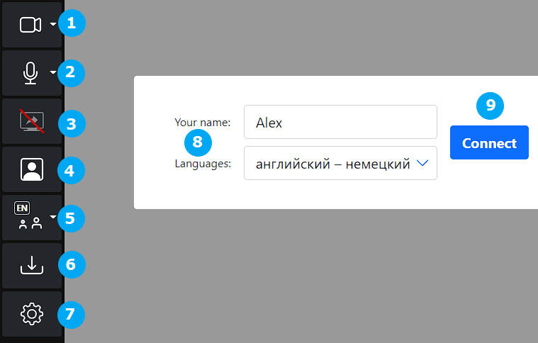

# Interpretisto: платформа синхронного перевода

**Interpretisto** — это программная платформа видеоконференцсвязи и удаленного синхронного перевода для проведения телеконференций и массовых онлайн- и выездных мероприятий с синхронным переводом.

Платформа предлагает повышенную безопасность и конфиденциальность, так как не использует никакие публичные или сторонние сервисы удаленного синхронного перевода (RSI).

- Сервис коммуникации «два в одном»: видеоконференцсвязь + Удаленный синхронный перевод (SRI, VRI).
- Безопасность: никакие публичные сервисы RSI не применяются. Платформа построена на RSI-сервере и его обвязке собственной разработки и может быть установлена на одном компьютере в защищенной сети предприятия заказчика. Аудио- и видеоданные не отправляются ни на один общедоступный сервер.
- Простота использования: участнику конференции с любой ролью нужен только веб-браузер. Не требуется установка никаких программ для настольного компьютера или мобильных приложений для смартфона. В браузере реализован весьма гибкий интерфейс пользователя, одинаково удобный для пользователей с самыми разными ролями.
- Функции связи: участникам конференции можно по электронной почте отправлять ссылки на виртуальные конференц-залы **Interpretisto** с датой и временем запланированного мероприятия. Участникам доступны общий чат, демонстрация экрана и выбор языка синхронного перевода.
- Синхронный перевод: платформа обеспечивает многоканальную потоковую передачу звука для поддержки синхронного перевода на несколько языков параллельно. Виртуальное рабочее место синхрониста оснащено стандартными элементами управления. Переводчики видят и слышат все, что происходит на конференции, включая общение участников в чате вебинара или конференции.

## Роли участников конференции

**Interpretisto** поддерживает разделение ролей участников конференции. Для каждой роли автоматически создаются отдельные ссылки и коды для подключения к конференции.

- Докладчик (Presenter): роль выступающего на конференциях типа вебинара ([Функции](http://logrus.co/#/interpretisto?id=presenter));
- Участник (Participant): роль полноправного участника на конференциях типа совещаний ([Функции](http://logrus.co/#/interpretisto?id=participant));
- Переводчик (Interpreter): роль устного переводчика, необходимого на любой международной конференции ([Функции](http://logrus.co/#/interpretisto?id=interpreter));
- Слушатель (удаленный) (Attendee (Event Remote)): роль для участников онлайн-конференций типа вебинара ([Функции](http://logrus.co/#/interpretisto?id=attendee-event-local));
- Слушатель (в зале) (Attendee (Event Local)): роль для участников международных конференций с физическим присутствием на мероприятии ([Функции](http://logrus.co/#/interpretisto?id=attendee-event-remote));

## Технические требоания

В **Interpretisto** разные роли пользователей отличаются требованиями к скорости канала подключения и программному и аппаратному оснащению рабочего места:

| Роль | Исх/входящая скорость подключения | Веб-браузер | Видеокамера | Микрофон | Гарнитура | Тип устройства |
| --------------- | -------------------- | ------------------------- | ----------- | ----------- | ----------- | ------------------ |
| Участник | 5 Мбит/с или выше | Firefox 60+ или Chrome 74+ | опция | требуется | требуется | ПК, ноутбук или смартфон |
| Слушатель (удаленный) | 5 Мбит/с или выше | Firefox 60+ или Chrome 74+ | не нужно | не нужно | требуется | ПК, ноутбук или смартфон |
| Докладчик | 5 Мбит/с или выше | Firefox 60+ или Chrome 74+ | требуется | требуется | не нужно | ПК или ноутбук |
| Переводчик | 10 Мбит/с или выше\* | Firefox 60+ или Chrome 74+ | опция | требуется | требуется | ПК или ноутбук |
| Слушатель (в зале) | 5 Мбит/с или выше | Firefox 60+ или Chrome 74+ | не требуется | не требуется | Required | смартфон |

\* *проводное подключение крайне желательно для более стабильной связи*

Подключите свои гарнитуру и видеокамеру и разрешите браузеру доступ к этим устройствам до входа в систему **Interpretisto**.  Рекомендуется расположиться в тихом месте без фоновых шумов, с хорошим освещением в случае использования видеокамеры для стрима. Всегда выключайте микрофон, когда вы не говорите сами.

## Подключение к Interpretisto

1. Для подключения к конференции откройте в браузере присланную вам ссылку Interpretisto.
2. Либо на сайте http://interpretisto.logrusglobal.com введите код конференции и нажмите кнопку **Join Conference**.

Участники с ролью **Докладчик (Presenter)** или **Слушатель (в зале) (Attendee (Event Local))** смогут войти в конференцию немедленно.

Участникам с ролью **Участник (Participant)**, **Переводчик (Interpreter)** или **Слушатель (удаленный) (Attendee (Event Remote))** предалагается окно подключения к конференции:

Здесь перед подключением можно настроить различные параматеры и фукнции конференции, доступные для данной роли, такие как стриминг аудио и видео (1, 2), вид камеры (3), дополнительные материалы (4) и меню опций (5). 

Участники с ролью **Участник (Participant)** или **Переводчик (Interpreter)** должны ввести свое имя (6) перед подключением. А переводчик должен также выбрать языковую пару.

По завершении настройки нажмите кнопку **Connect** (7) для входа в конференцию.

## Available Functions

**Interpretisto** provides a unique set of available functions for each user role, as all of them differ in the types of data they can stream and receive.

It's important to note that the **Interpretisto** UI is adaptive, and will adjust to the available hardware and software, as well as conference settings. If your device does not have a connected webcam or another source of video streaming, the **Video Streaming** button will not appear in your UI even if your role enables video streaming. Similarly, if the conference has no language pairs selected - i.e., does not require interpretation - the **Turn interpretation on/off** button will not appear, and, if the conference does not include any additional materials, the **Download additional materials** button will not appear either.

### Presenter

As a **Presenter**, you can stream your video and audio, as well as share your screen.

You will have access to the additional materials of the conference (if any) via the **Download additional materials** button.

The **On Air** switch starts your presentation, enabling you to stream video and audio.

The following UI elements and functions are available to a **Presenter**:

1. *Video Streaming On/Off and streaming source selection*
2. *Audio Streaming On/Off*
3. *Screen Sharing On/Off*
4. *My Camera View On/Off*
5. *Download Additional Materials*
6. *Options Menu*
7. *Video Streaming Window*
8. *On Air switch & Mute*

### Participant

As a **Participant**, you can, by default:

- Stream your video and audio;
- Share your screen;
- See and hear what the other **Participants** and **Presenters** are streaming and sharing;
- Access the chat.

If the conference has interpretation enabled, you will be able to choose your preferred language in order to hear the simultaneous interpretation being done for that language. Any other audio will be reduced in volume to 30%, by default, to make the interpreration easier to hear. You can change this reduction rate in the **Options** menu. A green light will appear on your **Turn interpretation on/off** UI button if an **Interpreter** of the appropriate language pair is online.

You will have access to the additional materials of the conference (if any) via the **Download additional materials** button.

The following UI elements and functions are available to a **Participant**:

1. *Video Streaming On/Off and streaming source selection (on this screenshot, the user has no video streaming source available, thus streaming is disabled as is the My Camera View On/Off button)*
2. *Audio Streaming On/Off*
3. *Screen Sharing On/Off*
4. *Participant Panel Show/Hide*
5. *Chat Window Show/Hide*
6. *Interpretation On/Off and interpretation language selection*
7. *Download Additional Materials*
8. *Options Menu*
9. *Participant Panel*
10. *Current Speaker View*
11. *Chat Window*
12. *Leave Conference*

### Interpreter

As an **Interpreter**, you can see and hear what the users with the **Presenter** and **Participant** roles are streaming in video (active speaker only) and audio.

You can stream audio in a specific channel, audible only to **Participants** and **Attendees** who have switched on the appropriate interpretation language option, as well as to other **Interpreters** of your language pair.

You can monitor the chat as well.

**Interpreters** belonging to the same language pair can talk privately. They can see and hear each other, and have access to a private chat, exclusive to the **Interpreters** of their language pair.

The **On Air** switch signals that you are prepared to start interpreting, enabling you to stream audio.

You will have access to the additional materials of the conference (if any) via the **Download additional materials** button.

The following UI elements and functions are available to an **Interpreter**:

1. *Video Streaming On/Off and streaming source selection*
2. *Audio Streaming On/Off*
3. *Interpreter Panel Show/Hide*
4. *Chat Window Show/Hide*
5. *My Camera View On/Off*
6. *Download Additional Materials*
7. *Options Menu*
8. *On Air Switch*
9. *Interpretation language selection*
10. *Mute*
11. *Interpreter Panel*
12. *Current Speaker*
13. *Chat Window*
14. *My Camera View (present due to the My Camera View switch being put in the ON position)*
15. *Leave Conference*

### Attendee (Event Remote)

As an **Attendee (Event Remote)**, you can see and hear what the users with the **Presenter** and **Participant** roles are streaming in video and audio, as well as monitor the chat. 

If the conference has interpretation enabled, you will be able to choose your preferred language in order to hear the simultaneous interpretation being done for that language. Any other audio will be reduced in volume to 30%, by default, to make the interpreration easier to hear. You can change this reduction rate in the **Options** menu. A green light will appear on your **Turn interpretation on/off** UI button if an **Interpreter** of the appropriate language pair is online.

You will have access to the additional materials of the conference (if any) via the **Download additional materials** button.

The following UI elements and functions are available to an **Attendee (Event Remote)**:

1. *Participant Panel Show/Hide*
2. *Chat Window Show/Hide*
3. *Interpretation On/Off and interpretation language selection*
4. *Download Additional Materials*
5. *Options Menu*
6. *Participant Panel*
7. *Current Speaker*
8. *Chat Window*
9. *Leave Conference*

### Attendee (Event Local)

As an **Attendee (Event Local)**, you can only listen to any available **Interpreters** that translate into the language of your choice.

The following UI elements and functions are available to an **Attendee (Event Local)**:

1. *Interpretation language selection*
2. *Interpretation On/off*

## Managing Cofnerences

We've made the UI for managing conference to be as intuitive as possible. If you have been empowered to manage conferences, you can access the management page by simply clicking the **Manage Conferences** link in the upper right corner of the screen.

*The Management Screen*

Once there, you can create a new conference by writing its name in the text box and pressing the **Create Conference** button. If there are existing conferences, you can jump to the editing screen of a particular conference by clicking the link in its name, as well as close or delete them with the appropriate buttons.

*The Editing Screen*

On the editing screen, you can control every aspect of the conference:

- Set its name, or rename it at any time in the top section;
- Set the time period when the conference will be available using the **Schedule**  section;
- Set the language pair, or pairs, that will be used for interpreting - as many as you need, in the **Interpreted Language Pairs** section;
- Upload a picture to serve as a logo that all invitees will see in the top right corner of their UI, in the **Logo** section;
- Upload any files that you want your invitees (besides the **Attendee (Event Local)** role) to have access to, in the **Additional Materials** section;

In the top right corner of the UI, you will find a list of links and join codes. They are automatically generated for every available role in this conference, with the **Attendee (Event Local)** and **Interpreter** roles being enabled only for conferences with language pairs selected.

## Types of Conferences Possible

Interpretisto can be used for creating conferences of any kind. There are no strict pre-set rules, but possible variations include:

- A meeting-style conference of equal participants, with all users in the **Participant** role;
- A conference of equal participants, with users in the **Participant** role and some **Interpreters** invited;
- A webinar-type conference, with a single **Presenter** speaking, **Attendees** listening and **Interpreters** invited if necessary;
- A meeting/webinar hybrid, with both **Attendees** and **Participants**;