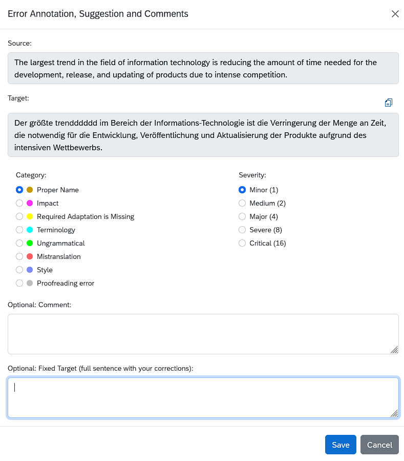
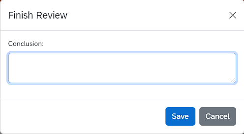

# Перфекционист — веб-сервис для измерения качества перевода (LQA)

Сервис позволяет измерять:
- качество перевода, 
- качество постредактуры машинного перевода, 
- качество сырого машинного перевода. 

Для оценки качества перевода используются встроенные метрики:
- стандартные метрики на базе отраслевой типологии ошибок MQM,
- специальная метрика LOGIPEM для оценки сырого и отредактированного машинного перевода,
- пользовательские метрики (по запросу). 

**Выборочная проверка** — для файлов большого объема предусмотрена возможность проверки случайной выборки заданного размера.

**Исключение повторов** — для получения более точных результатов при загрузке переводов в сервис исключаются повторяющиеся сегменты.

**Исполнители** — в качестве рецензентов можно привлекать штатных и сторонних экспертов.

**Отчеты** — результаты экспертизы качества оформляются и выгружаются в форме отчетов. 

**Отраслевые стандарты** — в основе данного решения лежат рекомендации международных организаций (ASTM International Committee F43) по внедрению современных методов измерения качества перевода, сочетающих аналитический и синтетический подходы.

**Расширяемый функционал** — для корпоративных пользователей функциональные возможности сервиса могут быть доработаны по запросу.

## Поддерживаемые форматы файлов

Поддерживаются следующие форматы двуязычных файлов, подлежащих экспертизе:
- **XLSX** (доступен файл-образец)
- **XLIFF**, **XLF**, **SDLXLIFF**, **TSV**

# Учетные записи и роли пользователей

Для работы с сервисом требуется учетная запись платформы Amberite Localization Cloud. Зарегистрироваться можно на странице https://cloud.amberites.ru/ по ссылке **Создать учетную запись**.

У пользователя может быть одна из трех ролей: **Requestor** (Заказчик), **Reviewer** (Рецензент) или **Stakeholder** (Наблюдатель). Роли назначаются администратором сервиса.

## Роль "Заказчик"

**Заказчик** оперирует страницей **Requestor Room** (https://lqa.amberites.ru/requestor-room). Ему доступны функции создания проектов с заданиями на экспертизу качества перевода, а также тестовых заданий для обучения и проверки навыков персонала.

### Создание LQA-проекта

Используется кнопка **Create Project** (Создать проект) в правой верхней части экрана.

Эта кнопка вызывает простое диалоговое окно, в котором предлагается указать имя создаваемого проекта.

Созданный проект появляется в общей таблице проектов на странице **Requestor Room**. Каждая строка таблицы описывает отдельный проект с указанием его вида и количества вложенных заданий (файлов), а также позволяет **Заказчику** выгрузить файл с результатами проекта или удалить проект.

Нажатие на название проекта, в который еще не были добавлены задания, открывает окно **New Job** (Новые задания). Кнопка **Create** (Создать) вызывает дополнительное окно, в которое можно перетащить двуязычные файлы подходящего формата; нажатие на пространство этого окна открывает стандартный диалог поиска файлов Windows Explorer.

В окне **New Job** также содержится ссылка для скачивания двуязычного файла-образца sample.xlsx.

При загрузке файла в сервис из него исключаются повторяющиеся сегменты перевода.

Если проект уже содержит задания, нажатие на его название в таблице переносит **Заказчика** на собственную страницу проекта. На этой странице представлена таблица заданий, содержащая все файлы, добавленные в проект, и присутствует возможность добавлений новых заданий с помощью кнопки **Create Task** (Создать задание).

Также на странице проекта имеется кнопка **Add User** (Добавить пользователя): с ее помощью **Заказчик** может приглашать пользователей на роль **Наблюдателей** (Stakeholders) проекта. Эта кнопка вызывает простое диалоговое окно для ввода адреса электронной почты пользователя, которому будет отправлено приглашение.

Переход на рабочую страницу задания происходит при нажатии на имя задания в списке на странице проекта.

При необходимости можно проверить не весь файл, а случайную выборку из него меньшего объема. **Заказчик** может задать размер выборки после загрузки файла с помощью поля **Sample size** (Размер выборки) над таблицей. После ввода нужного размера выборки необходимо нажать кнопку **Resample randomly** (Случайная выборка).

Вновь созданному заданию нужно назначить **Рецензента** - исполнителя работы (кнопка **Assign** (Назначить) в правом нижнем углу рабочей страницы). Для этого достаточно его адреса электронной почты.

Если у рецензента еще нет собственной учетной записи Amberite Localization Cloud, она будет создана автоматически на основе указанного адреса электронной почты с правами роли "**Рецензент**".

Во время назначения задания **Заказчик** может выбрать метрику для измерения качества. В данный момент это международная метрика **MQM** и наша собственная разработка **LOGIPEM**, адаптированная для оценки качества машинного перевода и результатов постредактирования, а также метрика **Holistic**. Любые пользовательские метрики можно добавить по запросу.

Нажание на название задания, уже назначенного **Рецензенту**, открывает страницу с двумя вкладками: **Status** (Статус) и **Results** (Результаты).

На вкладке **Results** **Заказчик** может просмотреть сегменты перевода, содержащиеся в задании, с пометками об ошибках в местах, отмеченных **Рецензентом**. Выше таблицы с сегментами находится сводка о найденных ошибках.

На вкладке **Status** по нажатию кнопки **Review mistakes** (Просмотреть ошибки) доступна подробная информация о каждой найденной **Рецензентом** ошибке. Здесь **Заказчик** может оставлять свои комментарии по поводу каждой ошибки, при необходимости - редактировать или удалять ошибки, а также предлагать собственный вариант полного перевода сегмента для поля **Fixed Target** (Исправленный перевод). Для этого служит диалоговое окно **Error Review** (Обзор ошибки), вызываемое нажатием на ошибку в таблице.

Если задание выполнено полностью, **Заказчик** завершает ее нажатием на кнопку **Finish Review** (Завершить оценку) справа снизу.

### Создание тестовых заданий

**Тестовые задания** используются для обучения сотрудников-лингвистов или для оценки их навыков. **Заказчик** может создавать два вида **тестовых заданий**: на **перевод** и на **редактуру**.

Кнопка **Create Testing Project** (Создать новое тестовое задание) вызывает диалог **New Testing Project** (Новое тестовое задание). В нем **Заказчику** нужно ввести название задания, выбрать один из существующих тестовых файлов и установить вид задания, которое будет выполнять лингвист.

После ввода этих данных нужно нажать на имя задания, а потом на кнопку **Create** (Создать), чтобы открыть диалог для ввода email-адреса испытуемого.

Если выбран вид задания **Translation** (Перевод), то поле **Your Input** (Ваш вариант) в сегментах тестового файла будет пустым, и испытуемый должен будет заполнить его. Если выбран вид задания **Editing** (Редактура), поле будет содержать текст для редактуры.

После того, как испытуемый нажмет на кнопку **Finish Task** (Завершить задание), завершенное тестовое задание можно будет назначить **Рецензенту** для проверки, как обычный LQA-проект. 

## Роль "Рецензент"

После назначения задания **Рецензент** получает уведомление по электронной почте со ссылкой на страницу задания. 

Если у **Рецензента** раньше не было учетной записи **Amberite Localization Cloud**, последует предложение создать пароль.

**Рецензент** оперирует страницей **Reviewer Room** (https://lqa.amberites.ru/reviewer-room). На ней представлена таблица, содержащая все задания, назначенные в адрес конкретного **Рецензента** **Заказчиками**.

**Рабочая область** задания открывается нажатием на ее название в таблице заданий. Она содержит таблицу для рецензирования со столбцами **Source** (Исходный текст), **Target** (Перевод), **Errors** (Ошибки), **Fixed Target** (Исправленный перевод) и флажком **Reviewed** (Оценено), который выставляется при вносе ошибки либо вручную.

**Рецензент** должен сверить исходный текст и перевод и в случае обнаружения ошибки выделить соответствующий фрагмент перевода.

Появится всплывающее окно **Error Annotation, Suggestion and Comments**, в котором можно ввести правильный вариант перевода или добавить комментарий. При этом необходимо выбрать категорию ошибки (**Category**) и ее значимость (**Severity**). Можно также предложить новый вариант полного перевода сегмента с помощью поля **Fixed Target** (Исправленный перевод).

В одном сегменте перевода можно разметить несколько ошибок, причем соответствующие фрагменты текста могут перекрываться.

По окончании экспертизы задание следует пометить как выполненное с помощью кнопки **Finish Review** (Завершить рецензирование). Появится всплывающее окно для ввода общего заключения по файлу, которое будет доступно **Заказчику**.

## Роль "Наблюдатель"

**Наблюдатель** оперирует страницей **Stakeholder Room** (https://lqa.amberites.ru/stakeholder-room). На ней предствлен список проектов, в которые **Наблюдатель** был приглашен их  **Заказчиками**.

Переход на страницу проекта осущетсвляется нажатием на его название в списке. В проекте **Наблюдателям** видны только те задания, которые уже были назначены **Рецензентам**.

**Наблюдатель** может просматривать находящиеся в обработке и выполненные задания так же, как это делает **Заказчик** на своей вкладке **Results**. Вносить изменения **Наблюдатель** не может.

# Результаты экспертизы

Как только **Рецензент** отметит задание как выполненное, **Заказчик** (как и приглашенные **Наблюдатели**) увидит на странице задания результаты экспертизы и сможет скачать таблицу формата **XLSX** с результатами, представленными согласно выбранной метрике. Загрузка доступна по нажатию на символы "скачать" в таблице заданий проекта.