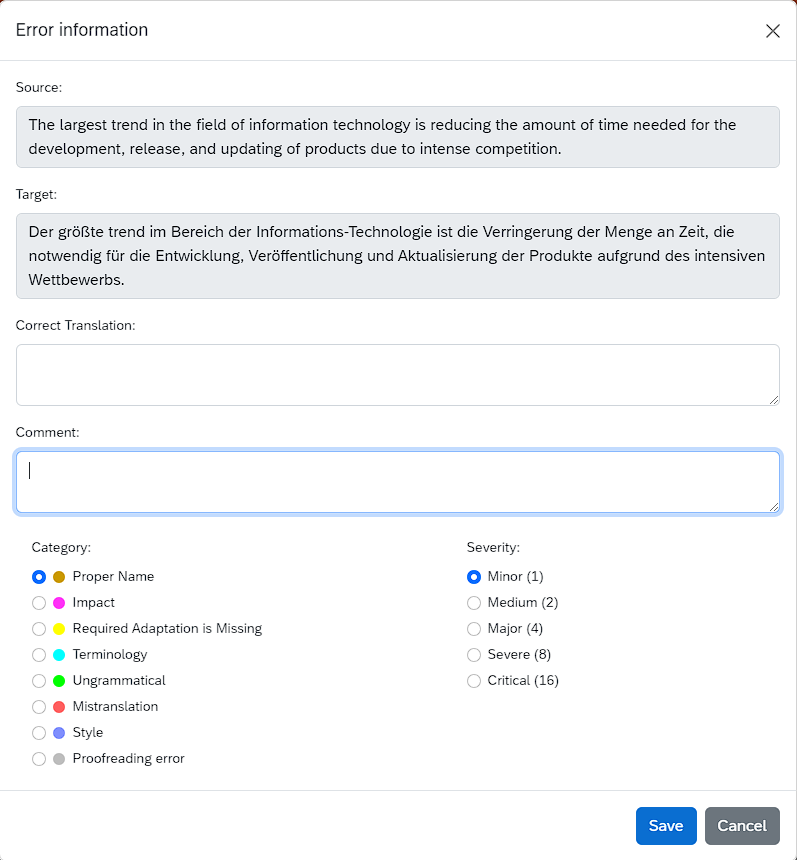
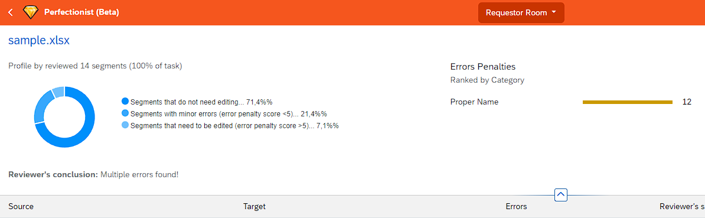

# Перфекционист — веб-сервис для измерения качества перевода (LQA)

Сервис позволяет измерять:
- качество перевода, 
- качество постредактуры машинного перевода, 
- качество сырого машинного перевода. 

Для оценки качества перевода используются встроенные метрики:
- стандартные метрики на базе отраслевой типологии ошибок MQM,
- специальная метрика LOGIPEM для оценки сырого и отредактированного машинного перевода,
- пользовательские метрики (по запросу). 

**Выборочная проверка** — Для файлов большого объема предусмотрена возможность проверки случайной выборки заданного размера.

**Исключение повторов** — для получения более точных результатов при загрузке переводов в сервис исключаются повторяющиеся сегменты.

**Исполнители** — в качестве рецензентов можно привлекать штатных и сторонних экспертов.

**Отчеты** — результаты экспертизы качества оформляются и выгружаются в форме отчетов. 

**Отраслевые стандарты** — в основе данного решения лежат рекомендации международных организаций (ASTM International Committee F43) по внедрению современных методов измерения качества перевода, сочетающих аналитический и синтетический подходы.

**Расширенный функционал** — для корпоративных пользователей функциональные возможности сервиса могут быть доработаны по запросу.

## Поддерживаемые форматы файлов

Поддерживаются следующие форматы двуязычных файлов, подлежащих экспертизе:
- **XLSX** (можно скачать файл-образец)
- **XLIFF**

# Учетные записи и роли пользователей

Для работы с сервисом требуется учетная запись платформы Amberite Localization Cloud. Зарегистрироваться можно на странице https://cloud.amberites.ru/ по ссылке **Создать учетную запись**.

У пользователя может быть одна из двух ролей: **Requestor** (Заказчик) или **Reviewer** (Рецензент). Роли назначаются администратором сервиса.

## Роль "Заказчик"

**Заказчик** создает задания на экспертизу качества перевода на странице https://lqa.amberites.ru/requestor-room. Для этого нажмите кнопку **Create** (Создать).

При необходимости можно проверить не весь файл, а выборку из него меньшего объема. **Заказчик** может задать размер выборки после загрузки файла с помощью поля **Sample size** (Размер выборки) над таблицей. После ввода нужного размера выборки необходимо нажать кнопку **Resample randomly** (Случайная выборка).

Вновь созданному заданию нужно назначить рецензента-исполнителя работы (кнопка **Assign** (Назначить)). Для этого достаточно его адреса электронной почты. Если у рецензента еще нет собственной учетной записи Amberite Localization Cloud, она будет создана автоматически на основе указанной эл. почты с правами роли "**Рецензент**".

Во время назначения задания **Заказчик** может выбрать метрику для измерения качества. В данный момент это международная метрика **MQM** и наша собственная разработка **LOGIPEM**, адаптированная для оценки качества машинного перевода и результатов постредактирования. Любые пользовательские метрики можно добавить по запросу.

## Роль "Рецензент"

После назначения задания **Рецензент** получает уведомление по эл. почте со ссылкой на страницу задания. 

Если у рецензента раньше не было учетной записи Amberite Localization Cloud, последует предложение создать пароль. После этого откроется таблица для рецензирования со столбцами **Source** (Исходный текст), **Target** (Перевод), **Errors** (Ошибки), и флажком **Reviewed** (Оценено), который выставляется при вносе ошибки либо вручную.

**Рецензент** должен сверить исходный текст и перевод и в случае обнаружения ошибки выделить соответствующий фрагмент перевода.

Появится всплывающее окно, в котором можно ввести правильный вариант перевода или добавить комментарий. При этом необходимо выбрать категорию ошибки (**Category**) и ее значимость (**Severity**).

В одном сегменте перевода можно разметить несколько ошибок, причем соответствующие фрагменты текста могут перекрываться.

По окончании экспертизы задание следует пометить как выполненное с помощью кнопки **Finish Review** (Завершить рецензирование). Появится всплывающее окно для ввода общего заключения по файлу, которое будет доступно **Заказчику**.

# Результаты экспертизы

Как только рецензент пометит задание как выполненное, **Заказчик** увидит на странице задания результаты экспертизы и сможет скачать таблицу формата **XLSX** с результатами согласно выбранной метрики.

