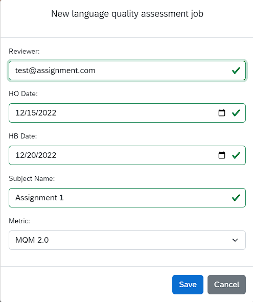

# Перфекционист — веб-сервис для измерения качества перевода (LQA)

Сервис позволяет измерять качество перевода по стандартным отраслевым и пользовательским метрикам, привлекать для этого сторонних экспертов, создавать отчеты. 

В основе данного решения лежат рекомендации международных организаций (ASTM International Committee F43) по внедрению современных методов измерения качества перевода, сочетающих аналитический и синтетический подходы.

## Учетные записи и роли пользователей

Для работы с сервисом требуется учетная запись платформы Amberite Localization Cloud. Зарегистрироваться можно на странице https://cloud.logrusglobal.com/. 

У пользователя может быть две роли: **Requestor** (Заказчик) или **Reviewer** (Рецензент).

### Роль "Заказчик"

**Заказчик** создает задания на экспертизу качества перевода на странице https://lqa.logrusglobal.com/requestor-room. Для этого на вкладке **Requestor** (**Заказчик**) нажмите кнопку **Create** (Создать).

Поддерживаются следующие форматы двуязычных файлов, подлежащих экспертизе: **XLS** (можно скачать файл-образец) и **XLIFF**.

При необходимости получения выборки с определенным количеством слов, меньшим, чем количество слов в файле, **Заказчик** может задать размер выборки после загрузки файла, с помощью поля **Sample size** над таблицей. После ввода нужного размера выборки необходимо нажать кнопку **Resample randomly** (Случайная выборка).

Вновь созданному заданию нужно назначить рецензента-исполнителя работы (кнопка **Assign** (Назначить)). Для этого достаточно его адреса электронной почты. Если у рецензента еще нет собственной учетной записи Amberite Localization Cloud, она будет создана автоматически на основе указанной эл. почты с правами роли "**Рецензент**".

Во время назначения задания **Заказчик** может выбрать метрику для измерения качества. В данный момент это международная метрика **MQM** и наша собственная разработка **LOGIPEM**, адаптированная для оценки качества машинного перевода и результатов постредактирования.

### Роль "Рецензент"

После назначения задания **Рецензент** получает уведомление по эл. почте со ссылкой на страницу задания. 

Если у рецензента раньше не было учетной записи Amberite Localization Cloud, последует предложение создать пароль. После этого откроется таблица для рецензирования со столбцами **Source** (Исходный текст), **Target** (Перевод), **Errors** (Ошибки), и флажком **Reviewed** (Оценено), который выставляется при вносе ошибки либо вручную.

**Рецензент** должен сверить исходный текст и перевод и в случае обнаружения ошибки выделить соответствующий фрагмент перевода.

Появится всплывающее окно, в котором можно ввести правильный вариант перевода или добавить комментарий. При этом необходимо выбрать категорию ошибки (**Category**) и ее значимость (**Severity**).

В одном сегменте перевода можно разметить несколько ошибок, причем соответствующие фрагменты текста могут перекрываться.

По окончании экспертизы задание следует пометить как выполненное с помощью кнопки **Finish Review** (Завершить рецензирование). Появится всплывающее окно для ввода общего заключения по файлу, которое будет доступно **Заказчику**.

**Заказчик** работы увидит на странице задания результаты экспертизы и сможет скачать таблицу формата **XLS** с результатами согласно выбранной метрики.

