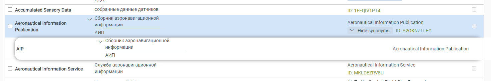
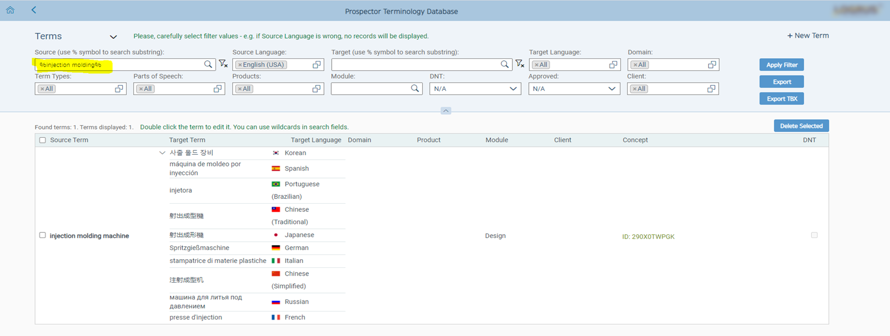
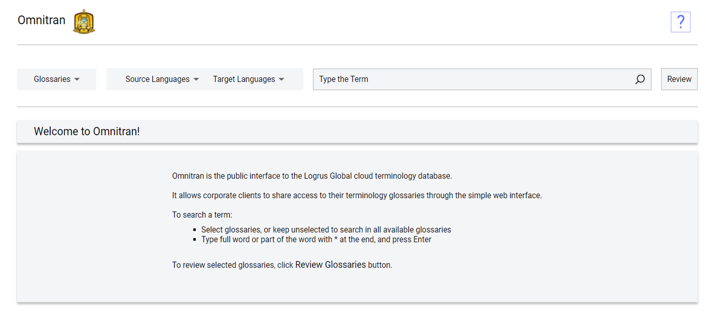
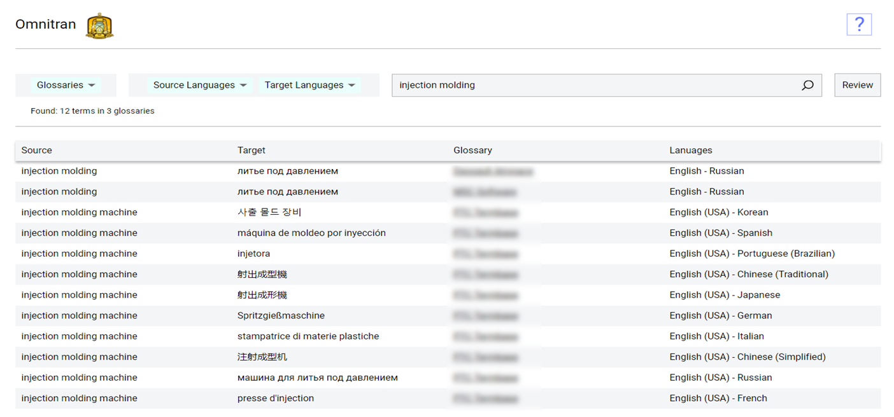

# The TermLode Application Family

The **TermLode** application family is a client-server, cloud-based terminology database solution designed for corporate use.

It is comprised of the following applications:

- The **TermLode** terminology database;
- The **Omnitran** Search application;
- The **Prospector** Terminology extractor;
- The **TermLode** Trados connector.

In the sense of achitecture, it has the following components:

- The **TermLode** termbank;
- The **TermLode** Cloud Front End;
- The **Omnitran** Cloud Front End;
- The **Prospector** Cloud Front End;
- The **TermLode** **Trados** Connector DLL.

# Concept and Design

## Data Model

The **TermLode** data model conforms to the TBX standard (ISO 30042). There’s a Concept in the root hierarchy, and terms in various languages are descendants from the root, as shown on the figure:

There's a One-to-Many relationship between a **Concept** and multiple **Terms** is any language, and a Many-to-Many relationship between **Terms** in different languages. This data model reflects the situation when one source term can have several terms for a target language and vice versa.

## User Experience

The View and Edit modes of **TermLode** reflect this from the usability perspective. 

When you double-click a term to edit it, the Edit dialog box opens and shows a multilingual One-to-Many hierarhy - from the **Concept** down to language **Terms**.

You can filter **Terms** by various conditions via the filter in the top of the window:

The **TermLode** data model organizes collections of **Terms** into **Glossaries** by client, as well as by topic. **Omnitran**, a glocal search front end web interface, enables you to carry out searches for a **Term** across multiple **Glossaries** at once.

You can select some or all **Glossaries** at once:

**Omnitran** can also divide a glossary into alphabetical sections:

## Architecture

**TermLode** has an SQL-based backen and a .NET-based frontend, which is an ideal architecture for cloud deployment:

**TermLode** can only be accessed by users via browser, as it is a completely web-based, cloud-ready application.

**TermLode** is built as a corporate application, implementing an ID service and roles to control access for various groups of users with different rights. 

The current roles are:

- Global Administrator
- Corporate Administrator
- Corporate User/Editor
- Terminologist
- Super Editor
- Super Terminologist
- Super Reviewer
- Viewer/Reviewer

