# Семейство приложений TermLode

Семейство приложений **TermLode** - это облачное решение, включающее в себя серверные и клиентские приложения для корпоративного использования. Оно позволяет создавать терминологические базы данных и управлять ими.

В семейство входят следующие приложения:

- Терминологическая БД **TermLode**;
- Поисковое приложение **Omnitran**;
- Экстрактор терминологии **Prospector**;
- Коннектор **TermLode**-**Trados**.

Архитектура **TermLode** включает следующие основные элементы:

- Термбанк **TermLode**;
- Облачный frontend **TermLode**;
- Облачный frontend **Omnitran**;
- Облачный frontend **Prospector**;
- DLL-библиотека коннектора **TermLode**-**Trados**.

## Модель данных

Модель данных **TermLode** соответствует стандарту TBX (ISO 30042). Корнем иерархии является **концепция**, и **термины** на различных языках происходят из неё, как показано на схеме:

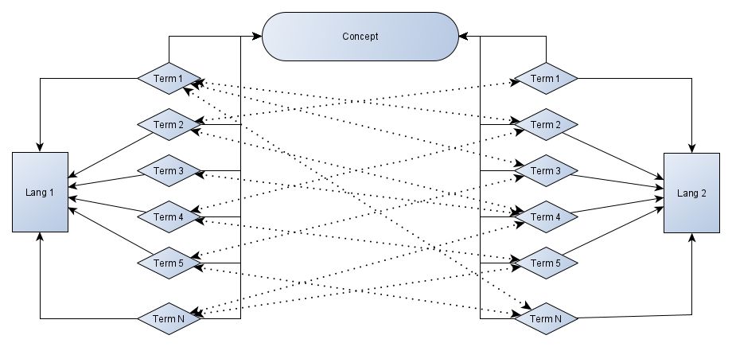

Между **концепцией** и набором **терминов** на любых языках существует связь типа "один ко многим", а между **терминами** на различных языках существует связь типа "многие ко многим". Таким образом, модель данных учитывает возможные ситуации, когда один **термин** на исходном языке может соответствовать нескольким **терминам** на языке перевода.

## Применение

### TermLode

После входа на страницу **TermLode** пользователь попадает на экран **Управления терминологическими базами данных**.

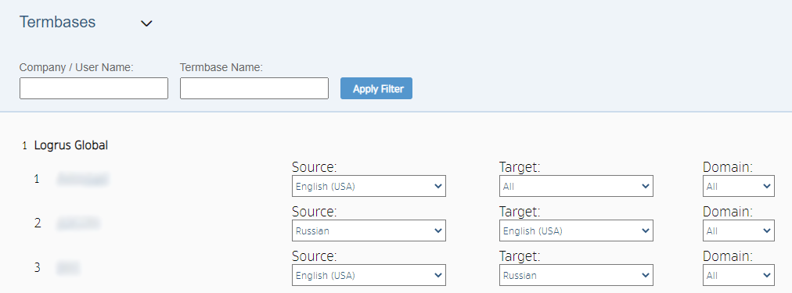

Здесь отображается список доступных пользователю **термбаз** (**терминологических баз данных**), сгруппированный по названиям компаний. Этот список можно фильтровать по названиям компаний или самих **термбаз**. Используя выпадающее меню наверху экрана, можно переключаться между этим списком и экраном создания новых **термбаз**: 

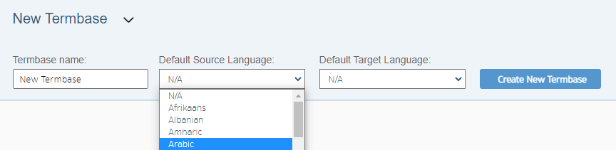

Для создания новой **термбазы** нужно ввести название, выбрать исходный язык и язык перевода по умолчанию, а затем нажать кнопку **Создать новую термбазу**. **TermLode** создаст новую **термбазу** без содержимого.

Нажатие на одно из названий **термбаз** ведет на экран **Терминологическая база данных**:

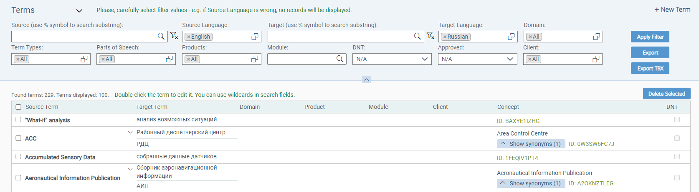

Верхнюю часть этого экрана занимает **фильтр терминов**. С его помощью можно заполнять **список терминов** под ним, отбирая **термины** из **термбазы** по выбранным значениям переменных:

- Исходный язык и текст;
- Язык и текст перевода;
- Бизнес-домены, к которым принадлежит **термин**;
- Типы **терминов** (концепция, сокращение и т.д.);
- Части речи, используемые в качестве **терминов**;
- Продукты, с которыми связаны **термины**;
- Модули;
- Наличие или отсутствие статуса "DNT" ("Не переводить");
- Наличие или отсутствие статуса "Одобренный **термин**";
- Клиент.

Кнопка **Применить фильтр** обновляет **список терминов** в соответствии с настройками **фильтра терминов**.

Кроме того, с помощью кнопок **Экспорт** и **Экспорт TBX** можно выгрузить **термины** из отфильтрованного **списка терминов** в виде файла XLSX или TBX соответственно.

Если в **фильтре терминов** установлено несколько языков перевода, **список терминов** будет отображать связь типа "один ко многим" между исходным **термином** и его переводами на соответствующие языки. При нажатии на исходный **термин** в **списке** открывается диалоговое окно редактирования, в котором отображается полная иерархия "один ко многим" - от **концепции** до каждого внесенного в базу **термина** на всех языках. В этом окне можно добавить новые **термины**-синонимы на присутствующих языках, либо выбрать новый язык для добавления **терминов**.

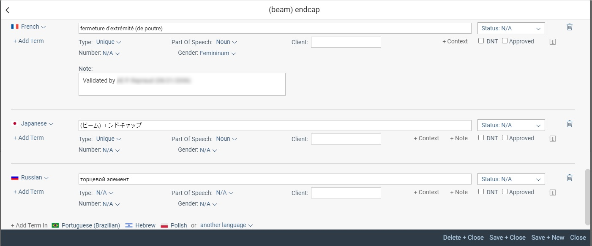

Кнопка **+ Новый термин** в правом верхнем углу **фильтра терминов** вызывает диалоговое окно, в котором можно обозначить новую **концепцию** и добавить соответствующие ей **термины**. Количество используемых языков и **терминов** ничем не ограничивается.

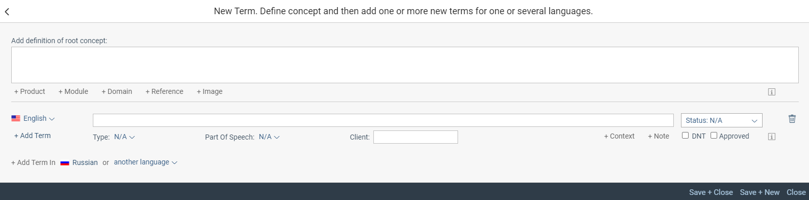

Можно удалить из базы несколько **терминов** одновременно, расставив галочки с левой стороны **списка терминов** и нажав кнопку **Удалить выделенные**.

Выпадающее меню над **фильтром терминов** служит для переключения верхней области между **фильтром терминов** и другими важными функциями:

- Меню настроек, в котором можно задать название **термбазы** и её настройки по умолчанию: исходный язык, язык перевода, бизнес-домен:

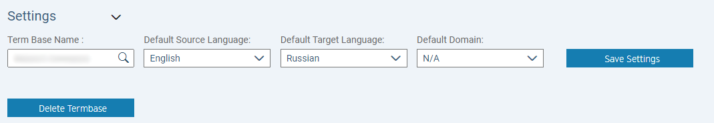

- Меню импорта, в котором можно импортировать **термины** из файлов XLSX (файл-пример предоставляется по ссылке):

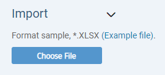

- Меню пользователей, в котором находится список пользователей, приглашенных в данную **термбазу** на различные роли. Здесь же можно приглашать новых пользователей, отправляя им ссылки на электронную почту:

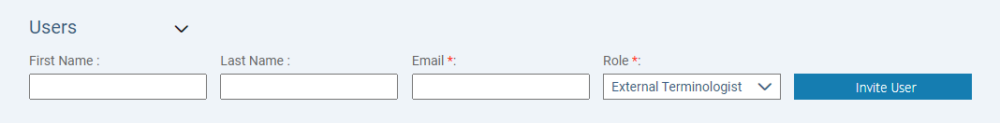

### OmniTran

Модель данных **TermLode** организует наборы **терминов** в **глоссарии** по различным темам и клиентам. Глобальный frontend-инетрфейс **OmniTran** позволяет осуществлять поиск **терминов** одновременно в наборе **глоссариев**.

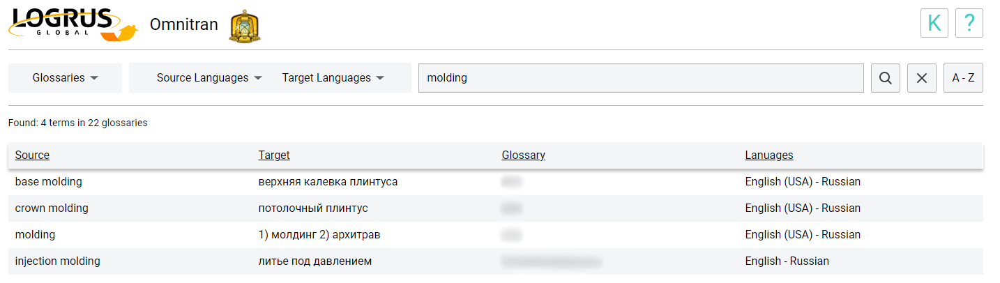

Можно выбрать как один **глоссарий**, исходный язык или язык перевода, так и любое другое их количество. Выбранные **глоссарии** можно просматривать в виде коллекций упорядоченных по алфавиту секций, по одному за раз, с помощью кнопки **A-Z**.

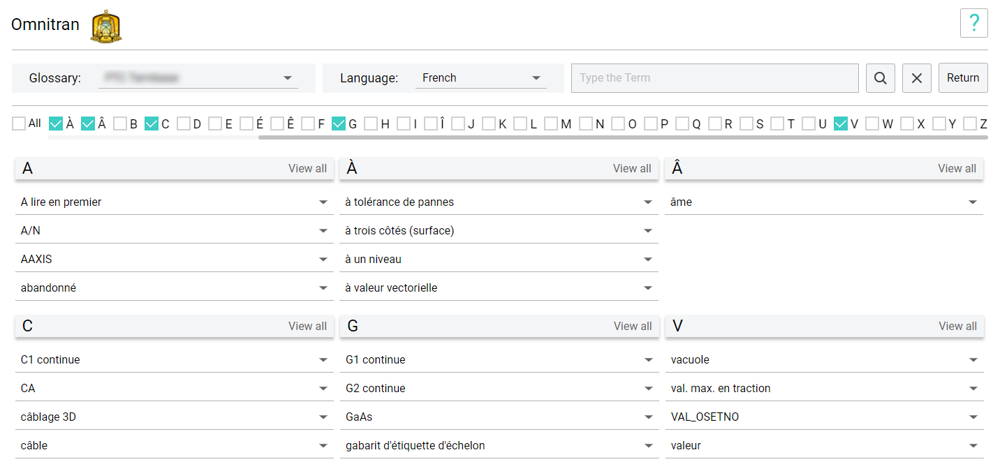

### Prospector

**Prospector** - это автоматический инструмент для извлечения англоязычной терминологии из текста с возможностью обзора и фильтрации полученных кандидатов в список **терминов**.

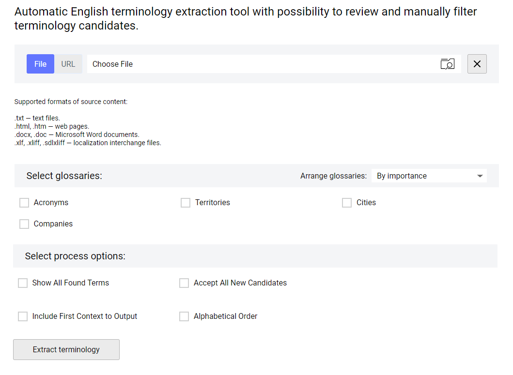

С помощью **Prospector** можно извлекать **термины** из файлов формата TXT, HTM/HTML, DOC/DOCX, XLF/XLIFF/SDXLIFF или из веб-страниц по ссылке. Для начала работы надо выбрать нужную позицию переключателя **файл/URL**, а затем либо скопировать адрес страницы в текстовое поле, либо нажать на него, чтобы вызвать диалог выбора файлов. Опциональный шаг - выбор существующих **глоссариев** и настройка других параметров извлечения терминологии, после чего процесс запускается нажатием кнопки **Извлечь терминологию**.

Все извлеченные **термины** отображаются в виде списка в окне **кандидатов терминологии**. Присутствуют возможности поиска по списку и сохранения помеченных **терминов** в виде файла XLS. Все **термины**, встреченные более чем один раз, помечаются автоматически.

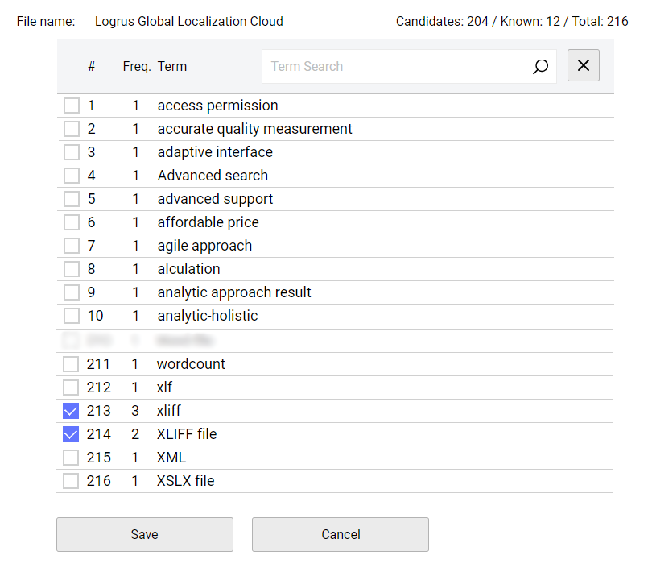

## Architecture

**TermLode** построен с сочетанием backend на основе SQL и frontend на основе .NET. Это идеальная архитектура для развертывания в облаке:

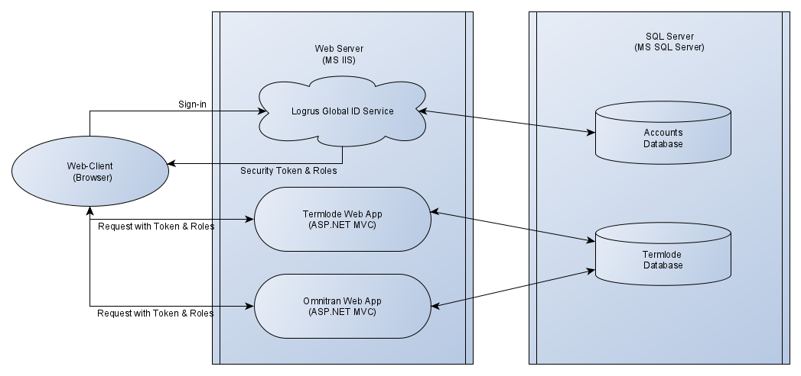

Доступ пользователей к **TermLode** осуществляется только с помощью браузера. Это на 100% веб-приложение, готовое к работе в облаке.

**TermLode** спроектирован для корпоративного использования. Предусмотрен набор ролей с различными правами для всевозможных групп пользователей.

Набор ролей включает в себя:

- Global Administrator (глобальный администратор)
- Corporate Administrator (корпоративный администратор)
- Corporate User/Editor (корпоративный пользователь/редактор)
- Terminologist (терминолог)
- Super Editor (супер-редактор)
- Super Terminologist (супер-терминолог)
- Super Reviewer (супер-читатель)
- Viewer/Reviewer (читатель)

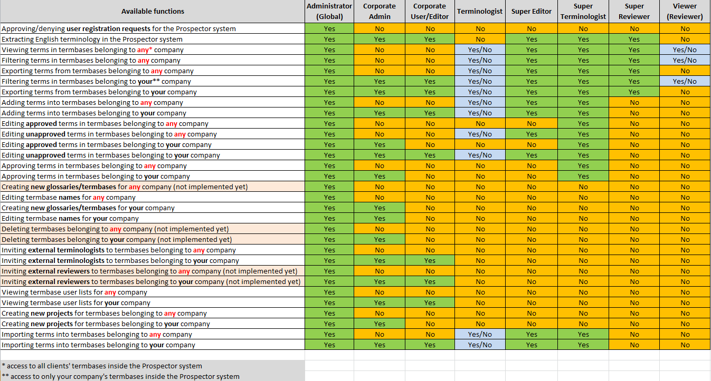